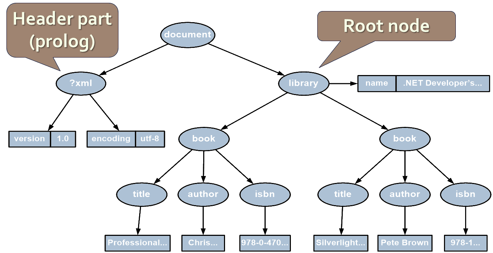

<!-- section start -->

<!-- attr: {id: 'title', class: 'slide-title', hasScriptWrapper: true} -->

# Processing XML in .NET
## DOM Parser, Streaming Parser, XPath, LINQ to XML
<div class="signature">
    <p class="signature-course">Databases</p>
    <p class="signature-initiative">Telerik Software Academy</p>
    <a href="http://academy.telerik.com" class="signature-link">http://academy.telerik.com</a>
</div>

<!-- section start -->
<!-- attr: {id: 'table-of-contents', class:'table-of-contents'} -->
# Table of Contents
* Processing XML documents in .NET
  * [Using the DOM Parser](#the-dom-parser)
  * [Using the Streaming Parser](#sax-and-stax-parsers)
* [Using XPath to Search in XML Documents](#using-xpath-in-net)
* [Using LINQ-To-XML](#linq-to-xml)
* [XSL Transformation in .NET](#xsl-transformations)

<!-- section start -->
<!-- attr: {id: 'the-dom-parser', class: 'slide-section', showInPresentation:true, hasScriptWrapper:true } -->
<!-- # The DOM Parser
## Parsing XML Documents as DOM Trees -->

<!-- attr: { hasScriptWrapper:true } -->
# The DOM Parser
* The following XML document is given:

```xml
<?xml version="1.0"?>
<library name=".NET Developer's Library">
  <book>
    <title>Professional C# 4.0 and .NET 4</title>
    <author>Christian Nagel</author>
    <isbn>978-0-470-50225-9</isbn>
  </book>
  <book>
    <title>Silverlight in Action</title>
    <author>Pete Brown</author>
    <isbn>978-1-935182-37-5</isbn>
  </book>
</library>
```

<!-- attr: { hasScriptWrapper:true, showInPresentation:true } -->
<!-- # The DOM Parser -->
* This document is represented in the in the memory as a `DOM tree` in the following way:


<!-- attr: { hasScriptWrapper:true } -->
# The DOM Parser – Example
```cs
XmlDocument doc = new XmlDocument();
doc.Load("library.xml");
XmlNode rootNode = doc.DocumentElement;
Console.WriteLine("Root node: {0}", rootNode.Name);
foreach (XmlAttribute atr in rootNode.Attributes)
{
  Console.WriteLine("Attribute: {0}={1}",
    atr.Name, atr.Value);
}
foreach (XmlNode node in rootNode.ChildNodes)
{
  Console.WriteLine("\nBook title = {0}",
    node["title"].InnerText);
  Console.WriteLine("Book author = {0}",
    node["author"].InnerText);
  Console.WriteLine("Book isbn = {0}",
    node["isbn"].InnerText);
}
```

<!-- attr: { showInPresentation:true, class:'slide-section' } -->
<!-- # Parsing XML Document with the DOM Parser -->
## [Demo]()

# Classes to Work with DOM
* The DOM parser provides few important classes:
  * `XmlDocument`
    * Represents the DOM tree
    * Usually contains two elements:
      * Header part (prolog) 
      * The root element of the XML document
  * `XmlNode`
    * Abstract base class for all nodes in a DOM tree

<!-- attr: { showInPresentation:true } -->
<!-- # Classes to Work with DOM -->
* `XmlElement`
  * Represents a XML element
* `XmlAttribute`
  * Represents an attribute of an XML tag (couple name-value)
* `XmlAttributeCollection`
  * List of XML attributes attached to an element
* `XmlNodeList`
  * List of XML DOM nodes

# The XmlNode Class
* The class `System.Xml.XmlNode`:
  * Fundamental for the DOM processing
  * Represents a base node
  * Its inheritor-classes are:
    * `XmlDocument`, `XmlElement`, `XmlAttribute`, `XmlDeclaration`, …
  * Allows navigation in the DOM tree:
    * `ParentNode` – returns the parent node (`null` for the root)

<!-- attr: { showInPresentation:true } -->
<!-- # The XmlNode Class -->
* * `PreviousSibling` / `NextSibling` – returns the left / right node to the current
  * `FirstChild` / `LastChild` – returns the first / last child of the current node
  * `Item` (indexer `[]` in C#) – returns the child of the current node by its name
* Working with the current node:
  * `Name` – returns the name of the node (element, attribute …)
  * `Value` – gets the node value

<!-- attr: { showInPresentation:true } -->
<!-- # The XmlNode Class -->
* * `Attributes – returns the node attributes as XmlAttributeCollection
  * `InnerXml, OuterXml – returns the part of the XML containing the current node
    * Respectively with or without the node itself
  * `InnerText – concatenation of the values of the node and its inheritors
  * `NodeType – returns the node type

<!-- attr: { showInPresentation:true } -->
<!-- # The XmlNode Class -->
* Changing of the current node:
  * `AppendChild(…)` / `PrependChild(…)`
    * Inserts new child after / before all other children of the current node
  * `InsertBefore(…)` / `InsertAfter(…)`
    * Inserts new child before / after given inheritor
  * `RemoveChild(…)` / `ReplaceChild(…)`
    * Removes / replaces given child

<!-- attr: { showInPresentation:true } -->
<!-- # The XmlNode Class -->
* * `RemoveAll()` – deletes all children of the current node (element, attribute …)
  * `Value`, `InnerText`, `InnerXml` – changes the  value / text / XML text of the node

# The XmlDocument Class
* The `System.Xml.XmlDocument`
  * Contains XML document represented as DOM tree
  * Allows loading and saving XML document (from files, streams or strings)
  * `Load(…)`, `LoadXml(…)`, `Save(…)`
* Important properties, methods and events:
  * `DocumentElement` – returns the root element

<!-- attr: { showInPresentation:true } -->
<!-- # The XmlDocument Class -->
* Important properties, methods and events:
  * `PreserveWhitespace` – indicates if the white space to be kept during save or load
  * `CreateElement(…)`, `CreateAttribute(…)`, `CreateTextNode(…)` – creates new XML element, attribute or value for the element
  * `NodeChanged`, `NodeInserted`, `NodeRemoved` – events for tracking the changes in the document

<!-- attr: { class:'slide-section', showInPresentation:true } -->
<!-- # Modifying XML Document Using the DOM Parser -->
## Demo

<!-- section start -->
<!-- attr: {id: 'sax-and-stax-parsers', class: 'slide-section', showInPresentation:true, hasScriptWrapper:true } -->
<!-- # The Streaming Parser
## Using XmlReader and XmlWriter -->

# SAX and StAX Parsers
* SAX-style parsers are 'push' parsers
  * 'Push' data to the application
    * Event handlers for processing tags, attributes, data, whitespace, etc.
* StAX-like parsers are 'pull' parsers
  * 'Pull' the information from the parser as needed
  * The application moves the document's cursor forward (like reading a stream)
  * `XmlReader` is StAX-style (streaming) parser

# SAX and StAX Parsers and XmlReader
* In .NET stream processing of XML document is done with the `XmlReader` class
* `XmlReader` is abstract class, which:
  * Provides read-only access to the XML data
  * Works like a stream, but reads XML documents
    * Works in forward-only mode
  * Read at each step data (tags, attributes, text) can be extracted and analyzed

# The XmlReader Class
* The `XmlReader` class – most important methods and properties:
  * `Read()` – reads next node from the XML document or returns `false` if no such node
  * `NodeType` – returns the type of the read node
  * `Name` – returns the name of the read node (name of the last read element, attribute, …)
  * `HasValue` – returns true if the node has value
  * `Value` – returns the node value

<!-- attr: { showInPresentation:true } -->
<!-- # The XmlReader Class -->
* * `ReadElementString()` – reads the value (the text) from the last read element
  * `AttributeCount`, `GetAttribute(…)` – extract the attributes of the current element
* `XmlReader` is an abstract class
  * Instantiated with the static method `Create(…)`
  * Implements `IDisposable`

```cs
using (XmlReader reader = XmlReader.Create("items.xml"))
{
  while (reader.Read()) { … }
}
```

<!-- attr: { class:'slide-section table-of-contents', showInPresentation:true } -->
<!-- # Working with XmlReader -->
## [Demo]()

<!-- attr: { hasScriptWrapper:true } -->
# Working with XmlWriter
* The class `XmlWriter` creates XML documents
  * Works as a stream, but writes tags and data into XML documents
* Most important methods:
  * `WriteStartDocument()` – adds the prolog part in the beginning of the document (`<?xml …`)
  * `WriteStartElement(…)` – adds opening tag
  * `WriteEndElement()` – closes the last tag
  * `WriteElementString(…)` – adds an element by defined name and text value

<!-- attr: { showInPresentation:true } -->
<!-- # Working with XmlWriter -->
* * `WriteAttributeString(…)` – adds an attribute to the current element
  * `WriteEndDocument()` – closes all tags and flushes the internal buffer (by calling Flush())
* `XmlWriter` is an abstract class
  * Instantiated by that static method Create(…)
  * Implements `IDisposable`
  
```cs
using (var writer = new XmlTextWriter ("items.xml"))
{
  // Write nodes here
}
```

<!-- attr: { class:'slide-section table-of-contents', showInPresentation:true } -->
<!-- # Working with XmlWriter -->
## [Demo]()

<!-- section start -->
<!-- attr: {id: 'using-xpath-in-net', class: 'slide-section', showInPresentation:true, hasScriptWrapper:true } -->
<!-- # Using XPath -->

<!-- attr: { style:'font-size:0.95em' } -->
# Using XPath in .NET
* XPath functionality is implemented in the `System.Xml.XPath` namespace
* XPath can be used directly from the class `XmlNode` (and all its inheritors) :
  * `SelectNodes(string xPathExpression)`
    * Returns list of all nodes matched by the specified XPath expression
  * `SelectSingleNode(string xPathExpression)`
    * Returns the first node matched by the specified XPath expression

<!-- attr: { hasScriptWrapper:true } -->
# XPath and XmlNode – Example
* Suppose we want to find the beer's nodes

```xml
<?xml version="1.0" encoding="windows-1251"?>
<items>
  <item type="beer">
    <name>Zagorka</name>
    <price>0.75</price>
  </item>
  <item type="food">
    <name>sausages</name>
    <price>0.48</price>
  </item>
  <item type="beer">
    <name>Kamenitza</name>
    <price>0.65</price>
  </item>
</items>
```

<!-- attr: { showInPresentation:true } -->
<!-- # XPath and XmlNode – Example -->

```cs
static void Main()
{
  XmlDocument xmlDoc = new XmlDocument();
  xmlDoc.Load("../../items.xml");
  string xPathQuery = "/items/item[@type='beer']";
        
  XmlNodeList beersList =
    xmlDoc.SelectNodes(xPathQuery);
  foreach (XmlNode beerNode in beersList)
  {
    string beerName =
      beerNode.SelectSingleNode("name");
    Console.WriteLine(beerName.InnerText);
  }
}
```

<!-- attr: { class:'slide-section table-of-contents', showInPresentation:true } -->
<!-- # Searching with XPath in XML Documents -->
## [Demo]()

<!-- section start -->
<!-- attr: {id: 'linq-to-xml', class: 'slide-section', showInPresentation:true, hasScriptWrapper:true } -->
<!-- # LINQ to XML -->

# LINQ to XML
* `LINQ to XML`
  * Use the power of LINQ to process XML data
  * Easily read, write, modify, and search in XML documents
* Elements and attributes are no longer built-in the context of their parents
* LINQ to XML classes:
  * `XDocument` – represents a LINQ-enabled XML document (containing prolog, root element, …)

# LINQ to XML Classes
* LINQ to XML classes:
  * `XElement` – represents an XML element
    * The most fundamental class in LINQ to XML
    * Important methods: `Parse`, `Save`, `RemoveAtributes`, `SetElementValue`, `SetAtributeValue`, `WriteTo`
  * `XAttribute` – name/  value attribute pair
  * `XName` – tag name + optional namespace – `{namespace}localname` 
  * `XNamespace` – XML namespace

<!-- attr: { hasScriptWrapper:true } -->
# LINQ to XML – How Easy It Is!

```xml
<books>
    <book>
       <author>Don Box</author>
       <title>Essential .NET</title>
   </book>
</book>
```

* Need to create this XML fragment?

```cs
XElement books = 
  new XElement("books",
    new XElement("book",
      new XElement("author", "Don Box"),
      new XElement("title", "ASP.NET")
    )
 );
```

<!-- attr: { class:'slide-section table-of-contents', showInPresentation:true } -->
<!-- # Creating Document with LINQ To XML -->
## [Demo]()

# LINQ to XML and Namespaces
* Elements in LINQ to XML have fully expanded names (namespace + name)
  * Easy to manipulate the elements in different namespaces

```cs
XNamespace ns = "http://linqinaction.net";
XNamespace anotherNS = "http://publishers.org";
XElement book = new XElement(ns + "book",
    new XElement(ns + "title", "LINQ in Action"),
    new XElement(ns + "author", "Manning"),
    new XElement(ns + "author", "Steve Eichert"),
    new XElement(ns + "author", "Jim Wooley"),
    new XElement(anotherNS + "publisher", "Manning")
);
```

<!-- attr: { class:'slide-section table-of-contents', showInPresentation:true } -->
<!-- # LINQ to XML and Namespaces -->
## [Demo]()

# LINQ to XML – Searching with LINQ
* Searching in XML with LINQ is as easy as searching within an array

```cs
XDocument xmlDoc = XDocument.Load("../../books.xml");
var books =
  from book in xmlDoc.Descendants("book")
  where book.Element("title").Value.Contains("4.0")
  select new {
    Title = book.Element("title").Value,
    Author = book.Element("author").Value };
foreach (var book in books)
{
    Console.WriteLine(book);
}
```

<!-- attr: { class:'slide-section table-of-contents', showInPresentation:true } -->
<!-- # LINQ to XML and Namespaces -->
## [Demo]()

<!-- section start -->
<!-- attr: {id: 'xsl-transformations', class: 'slide-section', showInPresentation:true, hasScriptWrapper:true } -->
<!-- # XSL Transformations -->

# XSL Transformations
* XSL transformations (XSLT)
  * Convert a XML document to another XML document with different structure
  * Can convert XML to any text format
  * Can be used to transform XML documents to XHTML
* XSLT depends on XPath
  * For matching sections from the input document and replacing them with other text

# Performing XSLT in .NET
* .NET has built-in XSLT engine
  * System.Xml.Xsl.XslCompiledTransform
* Methods:
  * `Load(…)`
    * Loads XSL shylesheet for transforming XML docs
  * `Transform(…)`
    * Performs transformation of given XML
    * Output is written to a XML file, stream or `XmlWriter`

# XSL Transformation – Example
* Transforming XML document by given XSL stylesheet:

```cs
using System;
using System.Xml.Xsl;

class XSLTransformDemo
{
  static void Main()
  {
    XslCompiledTransform xslt = new XslCompiledTransform();
    xslt.Load("catalog.xsl");
    xslt.Transform("catalog.xml", "catalog.html");
  }
}
```

<!-- attr: { class:'slide-section table-of-contents', showInPresentation:true } -->
<!-- # Transforming XML by XSL Stylesheet -->
## [Demo]()

<!-- section start -->
<!-- attr: {id: 'questions', class: 'slide-section'} -->
# Questions
## Databases
