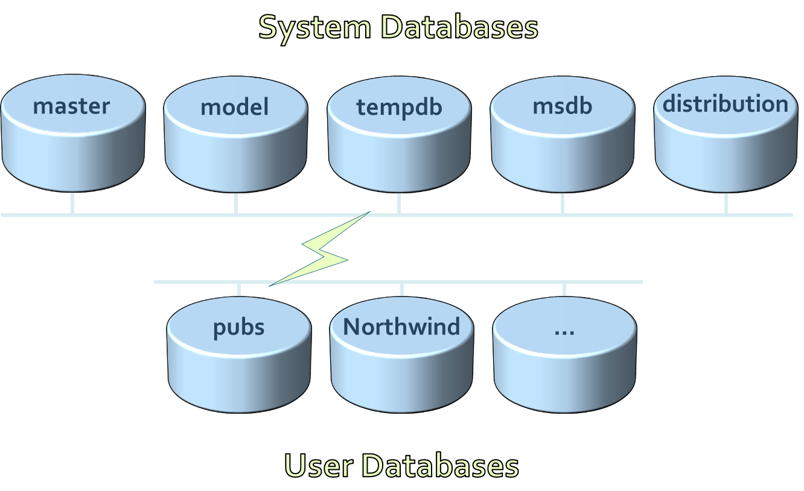
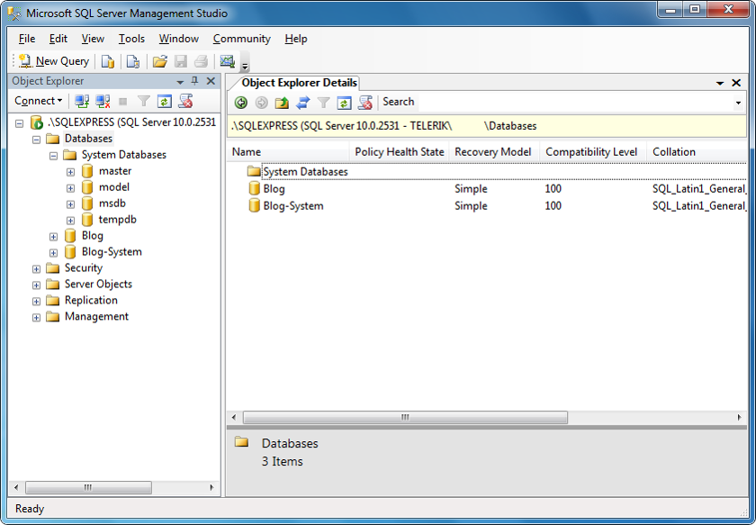
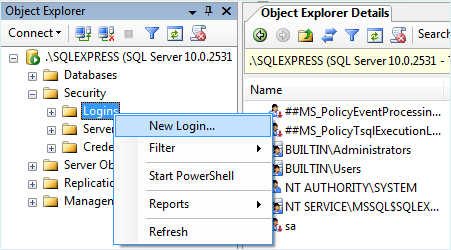
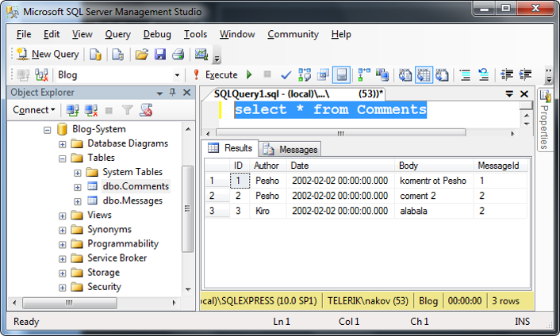
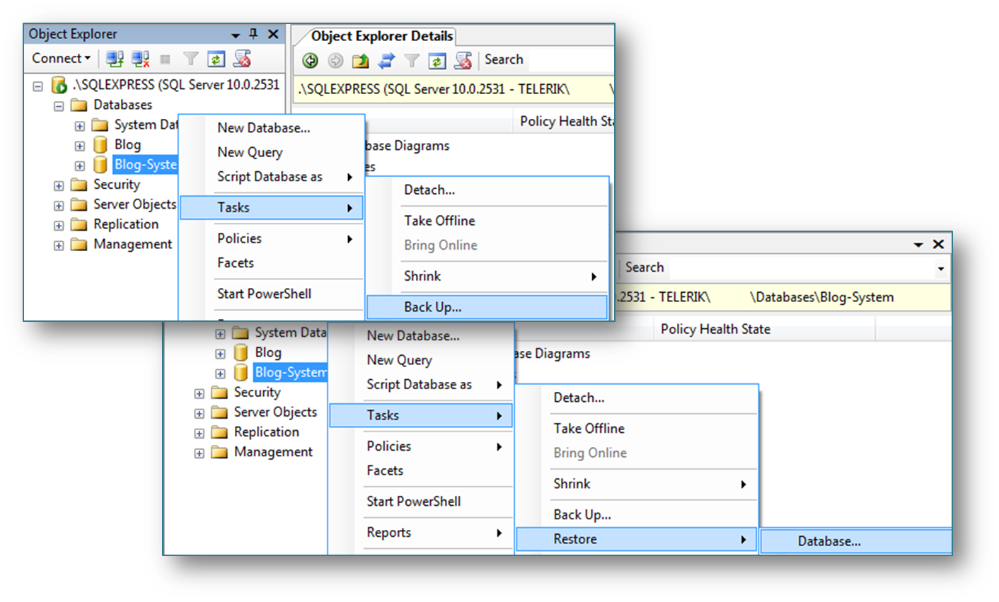
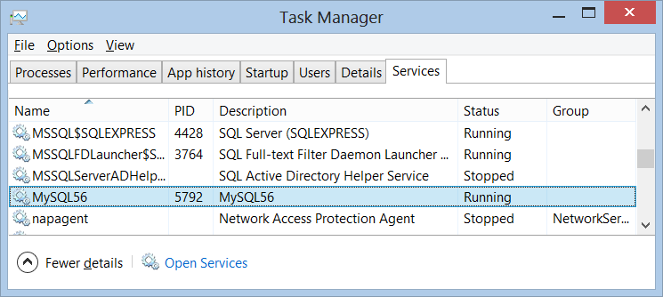
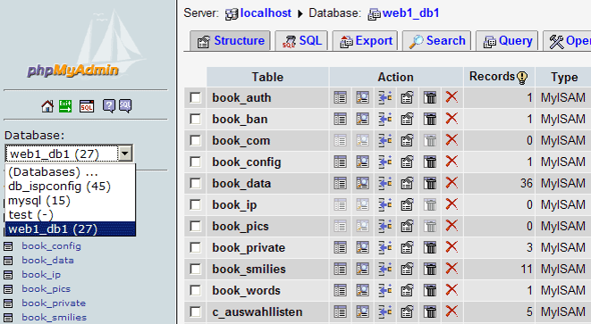

<!-- section start -->

<!-- attr: {id: 'title', class: 'slide-title', hasScriptWrapper: true} -->

# Introduction to SQL Server and MySQL

    
Databases

    
Telerik Software Academy

    <a href="http://academy.telerik.com" class="signature-link">http://academy.telerik.com</a>

<!-- section start -->
<!-- attr: {id: 'table-of-contents'} -->
# Table of Contents
*  `SQL Server 2012` – Intro
	*	SQL Server Services
	*	Types of Databases
	*	Authentication and Permissions
	*	SQL Server Management Studio
	*	Moving a SQL Server Database
		*	Through Backups and Restore
		*	By Detaching and Attaching 

# Table of Contents
*	`MySQL` – Intro
	*	MySQL Community Server
	*	MySQL Services, Start, Stop
	*	Authentication and Login
	*	MySQL Console Client
	*	MySQL Workbench
	*	phpMyAdmin Tool
	*	Moving a MySQL Database

<!-- section start -->
<!-- attr: {id: 'ms-sql-server', class: 'slide-section'} -->
# MS SQL Server
## Overview

# What is Microsoft SQL Server?
*	`MS SQL Server` is a Relational Database Management System (RDBMS) from Microsoft
	*	The main language supported in SQL Server is Transact SQL (T-SQL), an extension of SQL
	*	Powerful, trustworthy, easy-to-use DB server
*	The most recent version is SQL Server 2014
*	Works only on Windows systems
*	A free distribution exists (SQL Server Express)
	*	http://www.microsoft.com/express/database/

<!-- section start -->
<!-- attr: {id: 'sql-server-services', class: 'slide-section'} -->
# Services of SQL Server 2012

# Services of SQL Server 2012
*	SQL Server – the database engine
	*	Responsible for database management, data storage, queries, data manipulation, data integrity, transactions, locking, users, security
	*	Executes SQL / T-SQL queries
*	SQL Server Agent – DB monitoring
	*	Executes scheduled tasks
	*	Monitors SQL Server
	*	Sends notifications about problems

# Services of SQL Server 2012
*	Distributed Transaction Coordinator (MSDTC)
	*	Manages database transactions
	*	Supports transactions that span multiple databases
	*	Coordinates committing the distributed transaction across all the servers that are enlisted in the transaction
	*	Implements 2-phase commit

<!-- attr: {class: 'slide-section'} -->
# SQL Server Databases

# SQL Server Databases
*	SQL Server has system and user databases
*	`System databases`
	*	Maintain internal information about MS SQL Server as a system
	*	Don't play with them!
*	`User databases`
	*	Databases created by users (developers)
	*	Store user's schemas and data
	*	Use the system databases internally

<!-- section start -->
<!-- attr: {id: 'sql-server-types', class: 'slide-section'} -->
# Types of SQL Server Databases

<!-- attr: {hasScriptWrapper: true} -->
# Types of SQL Server Databases

# System Databases
*	`Master` – meta-database keeping data about
	*	User accounts
	*	Configurable environment variables
	*	System error messages
*	`Model` – a prototype for new databases
*	`Tempdb` – storage for temporary tables and database objects
*	`MSdb` – alerts and scheduled tasks

# SQL Server Databases
*	Each SQL Server database consists of two files:
	*	`.mdf` file
		*	Contains the core data in the database
		*	Schema, tables data, and other database objects
	*	`.ldf` file
		*	Transaction log – keeps track of transactions
*	You need both these files to use the database

<!-- section start -->
<!-- attr: {id: 'sql-server-authentication', class: 'slide-section'} -->
# SQL Server Authentication

# Connecting to SQL Server
*	Connecting to SQL Server requires
	*	The name of the server (e.g. localhost)
	*	The name of the DB instance (e.g. SQLEXPRESS)
	*	The name of the database (e.g. Northwind)
	*	Username / password (if using SQL Server authentication)
*	Types of authentication in SQL Server
	*	Windows (by using a Windows user credentials)
	*	Mixed (both Windows and SQL Server)

# SQL Server Users Permissions
*	Each user has certain permissions and roles for a database (Database User Account)
*	A role defines a group of users with the same permissions
*	There are 3 types of roles in MS SQL Server
	*	Fixed server roles
	*	Fixed database roles
	*	User-defined database roles

# Fixed Database Roles
*	`Public` – maintains all default permissions for users in a database
*	`Db_owner` – performs any database role activity
*	`Db_accessadmin` – add or remove database users, groups, and roles
*	`Db_ddladmin` – add, modify, or drop database objects
*	`Db_securityadmin` – assign statement and object permissions
*	Others…

<!-- section start -->
<!-- attr: {id: 'management-studio', class: 'slide-section'} -->
# SQL Server Management Studio
## A Powerful Management Tool for Administrators and Developers

# SQL Server Management Studio (SSMS)
*	SQL Server Management Studio (SSMS) is a powerful graphical DB management tool
	*	Administrate databases
		*	create, modify, backup / restore DB
	*	Create and modify E/R diagrams
	*	View / modify table data and other DB objects
	*	Execute SQL queries
	*	Free and easy to use tool
	*	Works with all SQL Server versions

<!-- attr: {hasScriptWrapper: true} -->
# SQL Server Management Studio – Screenshot

<!-- attr: {hasScriptWrapper: true} -->
# SSMS Setting Server Account
*	You can use SSMS to create database user / give permissions to Windows users
*	Follow these steps:
	* Right click on the [Security / Login] folder in Object Explorer and choose "New Login…"

# SSMS Setting Server Account
* In the next dialog click the `[Search]` button
	*	Select one of the Windows accounts in a typical Windows fashion
	*	Leave the authentication method set to Windows authentication
	*	Click `[OK]`	
*	Thus you create an SQL Server User account
	*	Account permissions could be assigned later
*	Windows administrators already have access

# SSMS Setting Database Account
1.	Right click on the `Security` under some of the databases and choose `New` > `User`
1.	Enter username and select one of the Server accounts to use
1.	Assign the roles for this user
1.	Click `[OK]` to confirm
	*	By selecting the `[Name-of-Database]` > `Properties` > `Permissions` you can also set specific permissions for the accounts
	
<!-- attr: {class: 'slide-section'} -->
# Creating Accounts and Assigning Permissions in SQL Server
## Live Demo

<!-- attr: {hasScriptWrapper: true} -->
# Executing SQL – Screenshot

<!-- attr: {class: 'slide-section'} -->
# Executing Simple SQL Queries in SQL Server Management Studio
## Live Demo

<!-- section start -->
<!-- attr: {id: 'moving-database', class: 'slide-section'} -->
# Moving an SQL Server Database

# Moving a SQL Server  Database
*	Necessary when we install a certain application at the customer environment
*	Ways of moving an SQL Server database:
	*	By backup and restore
		*	Create backup and restore it on the other server
	*	By detaching and attaching the database files
		*	The 2 servers must be the same versions!
	*	By dumping the database as SQL script
		*	Not supported in SSMS

<!-- attr: {hasScriptWrapper: true} -->
# Moving by Backup and Restore
*	Backup and restore database through SSMS

# Moving DB by Detaching and Attaching
*	On the source server:
	*	Choose the database in SQL Server Management Studio
	*	From the context menu we choose the Detach command
*	We copy the database files from the source server to the destination server:
	*	`[database_name].mdf`
	*	`[database_name].ldf`

<!-- attr: { class:'slide-section' } -->
# Moving a Database by Detaching and Attaching
## Live Demo

<!-- section start -->
<!-- attr: {id: 'mysql-server', class: 'slide-section'} -->
# MySQL Server
## Overview

# What is MySQL?
*	MySQL Database Server
	*	MySQL is `open-source` DB server (RDBMS)
	*	World's most-popular open-source database
	*	Mostly used to power web sites and small apps
	*	Supports concurrency, `transactions` (full ACID)
	*	Stored procedures, views, triggers, partitioning
	*	Support `clustering` and replication
*	Free and paid editions
	*	Community Server, Enterprise, Cluster CGE

# MySQL Community Server
*	MySQL Community Server
	*	The free open-source MySQL edition
	*	Windows: 
		*	Pre-packaged installer available from [MySQL](http://dev.mysql.com/downloads/mysql/)
	*	Linux: 
		*	Available through the package managers
			*	`apt-get install mysql-server`
			*	`yum install mysql-server`

# MySQL Storage Engines
*	`MyISAM`
	*	Fast, non-transactional  unreliable, forget it!
*	`InnoDB`
	*	Fully ACID transactional, highly reliable
	*	Recommended for most applications
*	`Memory`
	*	Ultra-fast, non-persistent
*	`CSV`
	*	Stores the data in CSV (text) files
*	[More info](https://dev.mysql.com/doc/refman/5.1/en/storage-engines.html)

<!-- attr: {hasScriptWrapper: true} -->
# MySQL Services, Start, Stop
*	MySQL Services
	*	Just one service (in Windows): `MySQL56`
	*	Starting: `net start MySQL56`
	*	Stopping: `net stop MySQL56`

<!-- attr: { class: 'slide-section' } -->
# MySQL Administration Tools
## The Console Client, MySQL Workbench, phpMyAdmin

# Authentication and Login
*	MySQL uses traditional username / password authentication
	*	The administrator's user is: `root`
	*	The default password is specified during the installation process
*	Connecting through the console client
	*	`mysql –u root -p`
	*	`use world;`
	*	`select * from city limit 100;`

<!-- attr: { class: 'slide-section' } -->
# MySQL Console Client
## Live Demo

<!-- attr: { class: 'slide-section' } -->
# MySQL Tools
## MySQL WorkBench, phpMyAdmin Tool

# MySQL Workbench
*	MySQL Workbench is free open-source GUI administration tool for MySQL
	*	Execute SQL queries
	*	Browse / edit table data
	*	Create / modify relational schema
	*	DB design  (E/R diagrams)
		*	Forward / reverse engineering
	*	Visualize query plan

<!-- attr: { class: 'slide-section' } -->
# MySQL Workbench
## Live Demo

<!-- attr: {hasScriptWrapper: true} -->
# phpMyAdmin Tool
*	phpMyAdmin Tool
	*	Web-based open-source MySQL admin tool

<!-- attr: { class: 'slide-section' } -->
# phpMyAdmin
## Live Demo

# Moving a MySQL Database
*	To move MySQL database to another location
	*	Use SQL export / SQL import feature
*	Export a database to SQL script
	*	MySQL Workbench > Server Administration > Data Export > Export to Self-Contained File
	*	phpMyAdmin > Export > SQL
*	Import a database from SQL script
	*	Just execute the script in Workbench
	*	phpMyAdmin > Import > SQL

<!-- section start -->
<!-- attr: {id: 'questions', class: 'slide-section', hasScriptWrapper: true} -->
# Questions
## Introduction to SQL Server and MySQL
