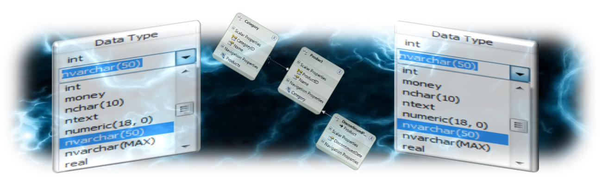
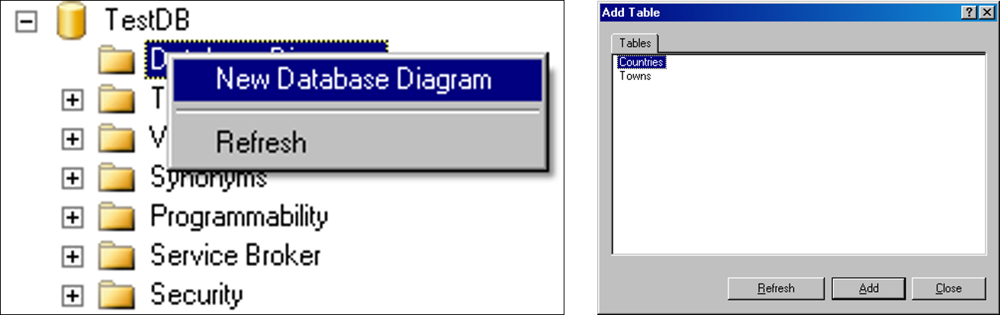
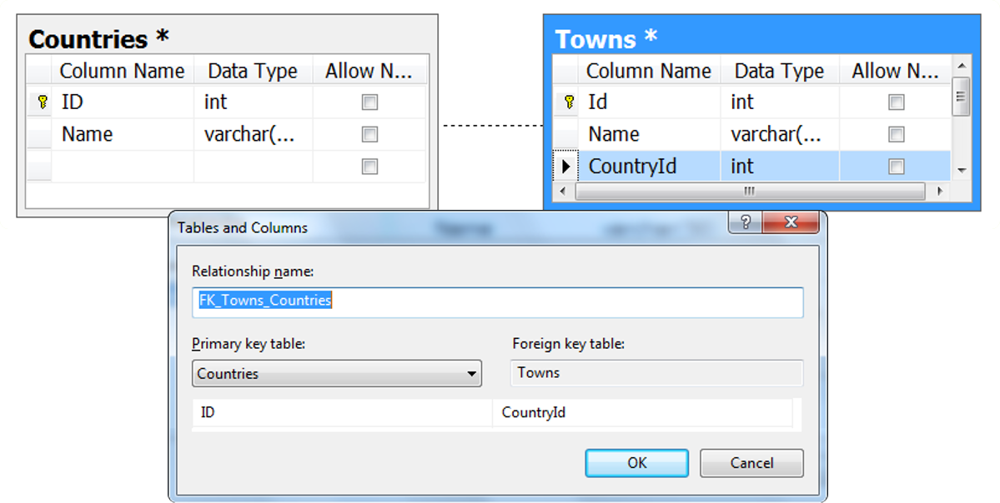

<!-- section start -->

<!-- attr: {id: 'title', class: 'slide-title', hasScriptWrapper: true} -->

# Database Modelling
## Creating E/R Diagrams with SQL Server Management Studio and MySQL Workbench
<div class="signature">
    <p class="signature-course">Databases</p>
    <p class="signature-initiative">Telerik Software Academy</p>
    <a href="http://academy.telerik.com" class="signature-link">http://academy.telerik.com</a>
</div>

<!-- section start -->
<!-- attr: {id: 'table-of-contents'} -->
# Table of Contents
*   Data Modelling – Principles
*	Data Types in SQL Server
*	Creating Databases in SQL Server
*	Creating Tables
*	Defining a Primary Key and Identity Columns
*	Creating Relationships between the Tables
	*	One-to-many, Many-to-many, One-to-one
*	Naming Conventions
*	Data Modelling in MySQL Workbench

<!-- section start -->
<!-- attr: {id: 'data-modelling', class: 'slide-section'} -->
# Relational Data Modelling
## Fundamental Concepts

# Steps in Database Design
*	Steps in the database design process:
	1.	Identification of the entities
	1.	Identification of the columns in the tables
	1.	Defining a primary key for each entity table
	1.	Identification and modelling of relationships
		*	Multiplicity of relationships
	1.	Defining other constraints
	1.	Filling test data in the tables

# Identification of Entities
*	Entity tables represent objects from the real world
*	Most often they are nouns in the specification
*	For example:

```xml
We need to develop a system that stores information about
students, which are trained in various courses. The courses
are held in different towns. When registering a new student
the following information is entered: name, faculty number,
photo and date.
```
*	Entities: Student, Course, Town

# Identification of Columns
*	Columns in the tables are characteristics of the entities
	*	They have name and type
*	For example students have:
	*	Name (text)
	*	Faculty number (number)
	*	Photo (binary block)
	*	Date of enlistment (date)

# Identification of the Columns
*	Columns are clarifications for the entities in the text of the specification, for example:

```xml
We need to develop a system that stores information about
students, which are trained in various courses. The courses
are held in different towns. When registering a new student
the following information is entered: name, faculty number,
photo and date.
```

*	Students have the following characteristics:
	*	Name, faculty number, photo, date of enlistment and a list of courses they visit

# How to Choose a Primary Key?
*	Always define an additional column for the primary key
	*	Don't use an existing column (for example SSN)
	*	Must be an integer number
	*	Must be declared as a primary key
	*	Use `identity` to implement auto-increment
	*	Put the primary key as a first column
*	Exceptions
	*	Entities that have well known ID, e.g. countries (BG, DE, US) and currencies (USD, EUR, BGN)

# Identification of Relationships
*	Relationships are dependencies between the entities:

```xml
We need to develop a system that stores information about
students, which are trained in various courses. The courses
are held in different towns. When registering a new student
the following information is entered: name, faculty number,
photo and date.
```

*	"`Students are trained in courses`" – many-to-many relationship
*	"`Courses are held in towns`" – many-to-one (or many-to-many) relationship

<!-- section start -->
<!-- attr: {id: 'data-types', class: 'slide-section'} -->
# Data Types in SQL Server 2012

# Data Types in SQL Server
*	Numeric
	*	`bit` (1-bit), `integer` (32-bit), `bigint` (64-bit)
	*	`float`, `real`, `numeric(scale, precision)`
	*	`money` – for money (precise) operations
*	Strings
	*	`char(size)` – fixed size string
	*	`varchar(size)` – variable size string
	*	`nvarchar(size)` – Unicode variable size string
	*	`text/ntext` – text data block (unlimited size)

# Data Types in SQL Server
*	Binary data
	*	`varbinary(size)` – a sequence of bits
	*	`image` – a binary block up to 1 GB
*	Date and time
	*	`datetime` – date and time starting from 1.1.1753 to 31.12. 9999, a precision of 1/300 sec.
	*	`smalldatetime` – date and time (1-minute precision)

<!-- attr: { hasScriptWrapper: true } -->
# Data Types in SQL Server
*	Other types
	*	`timestamp` – automatically generated number whenever a change is made to the data row
	*	`uniqueidentifier` – GUID identifier
	*	`xml` – data in XML format
 

# Data Types in SQL Server
*	`Nullable` and `NOT NULL` types
	*	All types in SQL Server may or may not allow `NULL` values
*	`Primary key` columns
	*	Define the primary key
*	`Identity` columns
	*	Automatically increased values when a new row is inserted (auto-increment values)
	*	Used in combination with `primary key`

<!-- section start -->
<!-- attr: {id: 'creating-database', class: 'slide-section'} -->
# Database Modelling with SQL Server Management Studio
## Creating Database

<!-- attr: { hasScriptWrapper: true } -->
# Connecting to SQL Server
*	When starting SSMS a window pops up
*	Usually it is enough to just click the "Connect" button without changing anything
 

# Working with Object Explorer
*	`Object Explorer` is the main tool to use when working with the database and its objects
*	Enables us:
	*	To create a new database
	*	To create objects in the database (tables, stored procedures, relationships and others)
	*	To change the properties of objects
	*	To enter records into the tables

<!-- attr: { hasScriptWrapper: true } -->
# Creating a New Database
*	In Object Explorer we go to the "Databases" and choose "New Database…" from the context menu
 

<!-- attr: { hasScriptWrapper: true } -->
# Creating a New Database
*	In the "New Database" window enter the name of the new database and click `[OK]`
 

<!-- section start -->
<!-- attr: {id: 'creating-diagrams', class: 'slide-section'} -->
# Database Modelling with SQL Server Management Studio
## Creating E/R Diagrams

<!-- attr: { hasScriptWrapper: true } -->
# Creating an E/R diagram
*	In the "Database Diagrams" menu choose the "New Database Diagram"


*	We can choose from the existing tables, which we want to add to the diagram

<!-- attr: { class: 'slide-section' } -->
# Database Modeling with SQL Server Management Studio
## Creating Tables

<!-- attr: { hasScriptWrapper: true } -->
# Creating Tables
*	If the database doesn't show immediately in Object Explorer perform "Refresh" [F5]
*	Creating new table:
 

<!-- attr: { hasScriptWrapper: true } -->
# Creating Tables
*	Enter table name  and define the table columns (name and type):
 

<!-- attr: { hasScriptWrapper: true } -->
# Creating Tables
*	Defining a primary key 
 

# Creating Tables
*	Defining an identity columns
	*	`Identity` means that the values in a certain column are auto generated (for `int` columns)
	*	These values cannot be assigned manually
	*	`Identity Seed` – the starting number from which the values in the column begin to increase.
	*	`Identity Increment` – by how much each consecutive value is increased

<!-- attr: { hasScriptWrapper: true } -->
# Creating Tables
*	Setting an identity through the "Column Properties" window
 

<!-- attr: { hasScriptWrapper: true } -->
# Creating Tables
*	It is a good practice to set the name of the table at the time it is created
	*	Use the "Properties" window
	*	If it's not visible use "`View`" > "`Properties Window`" or press `[F4]`
 

<!-- attr: { hasScriptWrapper: true } -->
# Creating Tables
*	When closing the window for the table, SSMS asks whether to save the table
	*	You can do it manually by choosing “`Save Table`” from the “`File`” menu or by pressing `Ctrl + S`
 

<!-- attr: { class: 'slide-section' } -->
# Database Modeling with SQL Server Management Studio
## Creating Relationships between Tables

<!-- attr: { hasScriptWrapper: true } -->
# Creating Relationships
*	To create one-to-many relationship drag the foreign key column onto the other table
	*	Drag from the child table to the parent table
 

<!-- attr: { hasScriptWrapper: true } -->
# Self-Relationships
*	Self-relationship can be created by dragging a foreign key onto the same table
 

<!-- section start -->
<!-- attr: {id: 'naming', class: 'slide-section'} -->
# Database Modelling with SQL Server Management Studio
## Naming Conventions

# Naming Conventions
*	Tables
	*	Each word is capitalized (Pascal Case)
	*	In English, plural
	*	Examples: `Users`, `PhotoAlbums`, `Countries`
*	Columns
	*	In English, singular
	*	Each word is capitalized (Pascal Case)
	*	Avoid reserved words (e.g. `key`, `int`, `date`)
	*	Examples: `FirstName`, `OrderDate`, `Price`

# Naming Conventions
*	Primary key
	*	Use "`Id`" or `name_of_the_table` + "Id"
	*	Example: in the `Users` table the PK column should be be called `Id` or `UserId`
*	Foreign key
	*	Use the name of the referenced table + "`Id`"
	*	Example: in the `Users` table the foreign key column that references the `Groups` table should be named `GroupId`

# Naming Conventions
*	Relationship names (constraints)
	*	In English, Pascal Case
	*	"`FK_`" + `table1` + "`_`" + `table2`
	*	For example: `FK_Users_Groups`
*	Index names
	*	"`IX_`" + `table` + `column`
	*	For example: `IX_Users_UserName`

# Naming Conventions
*	Unique key constraints names
	*	"`UK_`" + `table` + `column`
	*	For instance: `UK_Users_UserName`
*	Views names
	*	`V_` + `name`
	*	Example: `V_BGCompanies`
*	Stored procedures names
	*	`usp_` + `name`
	*	Example: `usp_InsertCustomer(@name)`

<!-- attr: { class: 'slide-section' } -->
# Database Modelling with SQL Server Management Studio
## Live Demo

<!-- section start -->
<!-- attr: {id: 'mysql-diagrams', class: 'slide-section'} -->
# Data Modelling in MySQL
## Creating E/R Diagrams with MySQL Workbench

# E/R Diagrams in MySQL Workbench
*	MySQL Workbench supports database schema design (E/R diagrams)
	*	Can `reverse engineer` an existing database
	*	Can `forward engineer` the diagram into SQL script / existing / new database
	*	Can `synchronize schema changes` with existing database
	*	User-unfriendly UI but  better than nothing
		*	Edit tables, relationships, indices, triggers, …

<!-- attr: { class: 'slide-section' } -->
# Data Modeling in MySQL
## Live Demo

<!-- section start -->
<!-- attr: {id: 'questions', class: 'slide-section'} -->
# Questions
## Database Modeling
