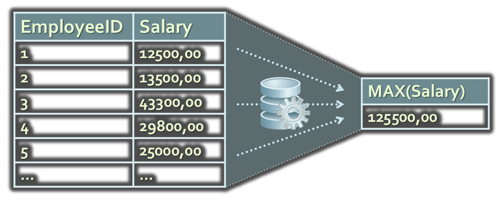
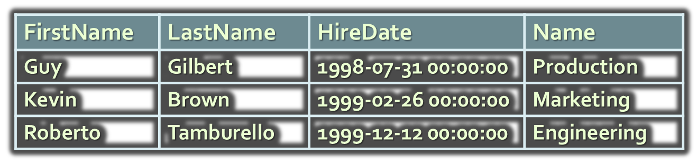
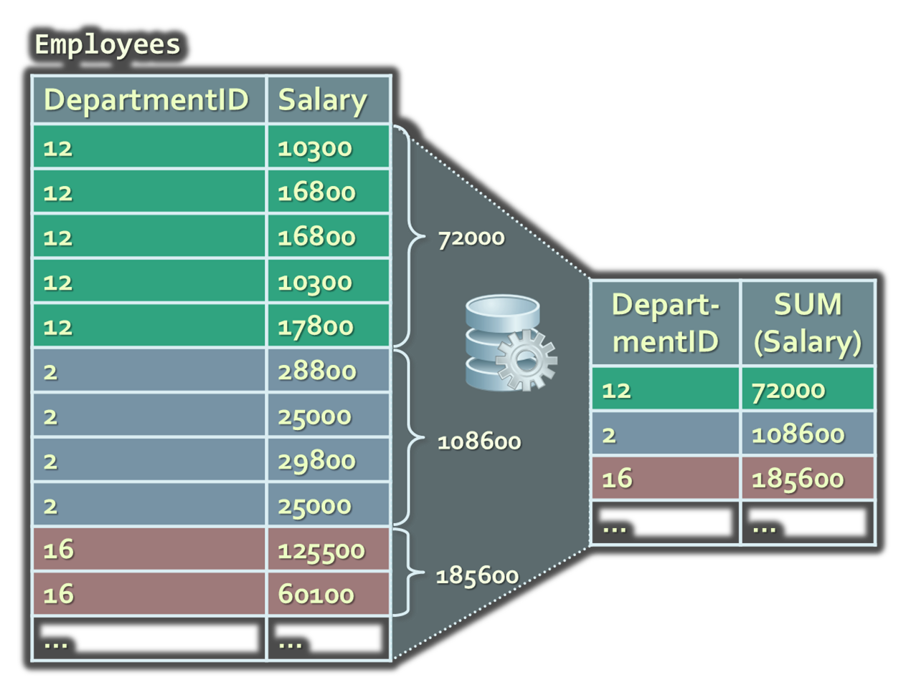
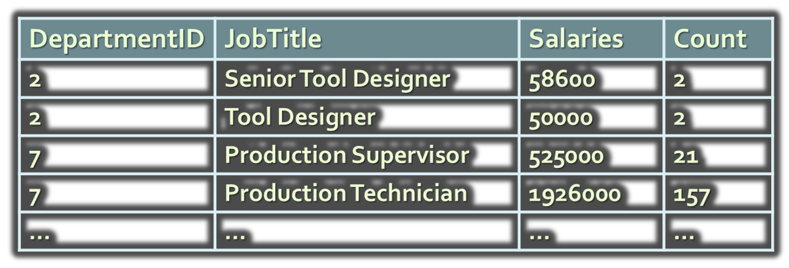
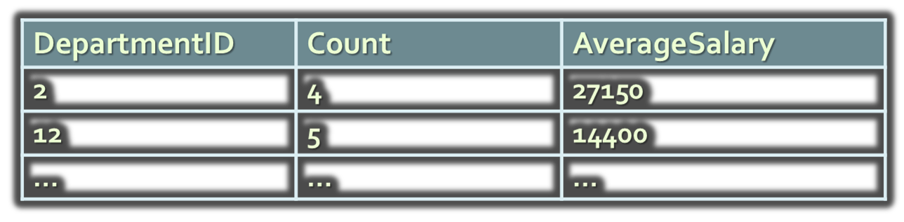
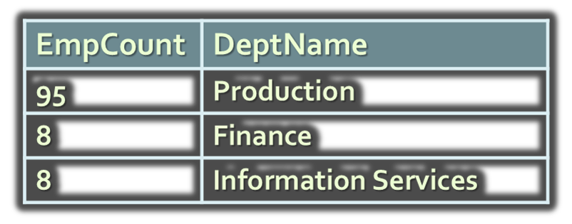

<!-- section start -->

<!-- attr: {id: 'title', class: 'slide-title', hasScriptWrapper: true} -->

# Advanced SQL
## Aggregations, Grouping, SQL Functions, DDL
<div class="signature">
    <p class="signature-course">Databases</p>
    <p class="signature-initiative">Telerik Software Academy</p>
    <a href="http://academy.telerik.com" class="signature-link">http://academy.telerik.com</a>
</div>

<!-- section start -->
<!-- attr: {id: 'table-of-contents'} -->
# Table of Contents
*   Nested SELECT Statements
*	Aggregating Data
	*	Group Functions and `GROUP` `BY`
*	Microsoft SQL Server Functions
*	Data Definition Language (DDL)
*	Creating Tables in MS SQL Server
*	Transactions

<!-- section start -->
<!-- attr: {id: 'nested-select', class: 'slide-section'} -->
# SQL Language
## Nested SELECT Statements

<!-- attr: { style:'font-size:0.9em' } -->
# Nested `SELECT` Statements
*	`SELECT` statements can be nested in the where clause

```sql
SELECT FirstName, LastName, Salary
FROM Employees
WHERE Salary = 
  (SELECT MAX(Salary) FROM Employees)
```
```sql
SELECT FirstName, LastName, DepartmentID, Salary
FROM Employees
WHERE DepartmentID IN 
  (SELECT DepartmentID FROM Departments
   WHERE Name='Sales')
```
*	_Note_: always prefer joins to nested `SELECT` statements for better performance

# Nested SELECT Statements with Table Aliases
*	Tables from the main `SELECT` can be referred in the nested `SELECT` by aliases
*	_Example_:
	*	Find the maximal salary for each department and the name of the employee that gets it

```sql
SELECT FirstName, LastName, DepartmentID, Salary
FROM Employees e
WHERE Salary = 
  (SELECT MAX(Salary) FROM Employees 
   WHERE DepartmentID = e.DepartmentID)
ORDER BY DepartmentID
```

# Using the EXISTS Operator
*	Using the `EXISTS` operator in `SELECT` statements
*	Using the `EXISTS` operator in `SELECT` statements
	*	Find all employees with managers from the first department

```sql
SELECT FirstName, LastName, EmployeeID, ManagerID
FROM Employees e
WHERE EXISTS
  (SELECT EmployeeID
   FROM Employees m
   WHERE m.EmployeeID = e.ManagerID
     AND m.DepartmentID = 1)
```

<!-- section start -->
<!-- attr: {id: 'aggregation', class: 'slide-section'} -->
# SQL Language
## Aggregating Data with Group Functions

<!-- attr: { hasScriptWrapper:true } -->
# Group Functions
*	Group functions operate over sets of rows to give one single result (per group)


# Group Functions in SQL
*	`COUNT(*)` – count of the selected rows
*	`SUM(column)` – sum of the values in given column from the selected rows
*	`AVG(column)` – average of the values in given column
*	`MAX(column)` – the maximal value in given column
*	`MIN(column)` – the minimal value in given column

<!-- attr: { hasScriptWrapper:true } -->
# `AVG()` and `SUM()` Functions
*	You can use AVG() and SUM() only for numeric data types

```sql
SELECT
  AVG(Salary) [Average Salary],
  MAX(Salary) [Max Salary],
  MIN(Salary) [Min Salary],
  SUM(Salary) [Salary Sum]
FROM Employees
WHERE JobTitle = 'Design Engineer'
```


<!-- attr: { hasScriptWrapper:true, style:'font-size:0.9em' } -->
# `MIN()` and `MAX()` Functions
*	You can use `MIN()` and `MAX()` for almost any data type (`int`, `datetime`, `varchar`, ...)
```sql
SELECT MIN(HireDate) MinHD, MAX(HireDate) MaxHD
FROM Employees
```

*	Displaying the first and last employee's name in alphabetical order:
```sql
SELECT MIN(LastName), MAX(LastName)
FROM Employees
```

<!-- attr: { hasScriptWrapper:true } -->
# The COUNT(…) Function
*	`COUNT(*)` returns the number of rows in the result record set

<div style="width:65%">
```sql
SELECT COUNT(*) Cnt FROM Employees
WHERE DepartmentID = 3
```
</div>


*	`COUNT(expr)` returns the number of rows with non-null values for the expr

<div style="width:65%">
```sql
SELECT COUNT(ManagerID) MgrCount,
  COUNT(*) AllCount
FROM Employees
WHERE DepartmentID = 16
```
</div>


<!-- attr: { hasScriptWrapper:true } -->
# Group Functions and NULLs
*	Group functions ignore `NULL` values in the target column

```sql
SELECT AVG(ManagerID) Avg,
  SUM(ManagerID) / COUNT(*) AvgAll
FROM Employees
```


*	If each `NULL` value in the `ManagerID` column were considered as 0 in the calculation, the result would be 106

<!-- attr: { hasScriptWrapper:true, style: 'font-size:0.9em' } -->
# Group Functions in Nested Queries
*	Find the earliest hired employee for each department

```sql
SELECT e.FirstName, e.LastName, e.HireDate, d.Name
FROM Employees e 
  JOIN Departments d
    ON e.DepartmentID = d.DepartmentID
WHERE e.HireDate = 
  (SELECT MIN(HireDate) FROM Employees 
   WHERE DepartmentID = d.DepartmentID)
```


<!-- attr: { class:'slide-section' } -->
# SQL Language
## Group Functions and the `GROUP` `BY` Statement

<!-- attr: { hasScriptWrapper:true } -->
# Creating Groups of Data


<!-- attr: { hasScriptWrapper:true } -->
# Grouping by Several Columns – Example
*	Example of grouping data by several columns:

```sql
SELECT DepartmentID, JobTitle, 
  SUM(Salary) as Salaries, COUNT(*) as Count
FROM Employees
GROUP BY DepartmentID, JobTitle
```


<!-- attr: { hasScriptWrapper:true } -->
# Illegal Use of Group Functions
*	This `SELECT` statement is illegal:
	*	Can not combine columns with groups functions unless when using `GROUP` `BY`

```sql
SELECT DepartmentID, COUNT(LastName)
FROM Employees
```	

*	This `SELECT` statement is also illegal
	*	Can not use `WHERE` for group functions

```sql
SELECT DepartmentID, AVG(Salary)
FROM Employees
WHERE AVG(Salary) > 30
GROUP BY DepartmentID
```


# Restrictions for Grouping
*	When using groups we can select only columns listed in the `GROUP` `BY` and grouping functions over the other columns

```sql
SELECT DepartmentID, JobTitle, 
  SUM(Salary) AS Cost, MIN(HireDate) as StartDate
FROM Employees
GROUP BY DepartmentID, JobTitle
```
*	*	Can not select columns not listed in the `GROUP` `BY` clause
	*	It is allowed to apply group functions over the columns in the `GROUP` `BY` clause, but has no sense

<!-- attr: { hasScriptWrapper:true } -->
# Using `GROUP` `BY` with `HAVING` Clause
*	`HAVING` works like `WHERE` but is used for the grouping functions

```sql
SELECT DepartmentID, COUNT(EmployeeID) as
  Count, AVG(Salary) AverageSalary
FROM Employees
GROUP BY DepartmentID
HAVING COUNT(EmployeeID) BETWEEN 3 AND 5
```



<!-- attr: { hasScriptWrapper:true, style:'font-size:0.85em' } -->
# Using Grouping Functions and Table Joins
*	Grouping function can be applied on columns from joined tables

```sql
SELECT COUNT(*) AS EmpCount, d.Name AS DeptName
FROM Employees e JOIN Departments d
    ON e.DepartmentID = d.DepartmentID
WHERE e.HireDate BETWEEN '1999-2-1' AND '2002-12-31'
GROUP BY d.Name
HAVING COUNT(*) > 5
ORDER BY EmpCount DESC
```



<!-- section start -->
<!-- attr: {id: 'server-functions', class: 'slide-section'} -->
# SQL Language
## SQL Server Functions

# Standard Functions in Microsoft SQL Server
*	Single-row functions
	*	String functions
	*	Mathematical functions
	*	Date functions
	*	Conversion functions
*	Multiple-row functions
	*	Aggregate functions

<!-- attr: { hasScriptWrapper:true, style:'font-size:0.9em' } -->
# `COALESCE()` Functions
*	`ISNULL(<value>,<default_value>)` – converts NULL values to given default value
*	`COALESCE(<value>,<value>,<value>)` – returns the first that is not `NULL`

```sql
SELECT Name AS [Projects Name], 
  ISNULL(EndDate, GETDATE()) AS [End Date]
FROM Projects
```


<!-- attr: { hasScriptWrapper:true, style:'font-size:0.9em' } -->
# String Functions
*	Changing the casing – `LOWER`, `UPPER`
*	Manipulating characters – `SUBSTRING`, `LEN`, `LEFT`, `RIGHT`, `TRIM`, `REPLACE`

```sql
SELECT LastName, LEN(LastName) AS LastNameLen,
  UPPER(LastName) AS UpperLastName
FROM Employees
WHERE RIGHT(LastName, 3) = 'son'
```


# Other Functions
*	Mathematical Functions – `ROUND`, `FLOOR`, `POWER`, `ABS`, `SQRT`, ...

```sql
SELECT FLOOR(3.14) --> 3
SELECT ROUND(5.86, 0) --> 6.00
```
*	Date Functions – `GETDATE`, `DATEADD`, `DAY`, `MONTH`, `YEAR`, …
*	Conversion Functions – `CONVERT`, `CAST`

```sql
SELECT CONVERT(DATETIME, '20051231', 112)
-->`2005-12-31 00:00:00.000`
--`112` is the ISO formatting style `YYYYMMDD`
```

<!-- attr: { hasScriptWrapper:true } -->
# Combining Functions
*	We can combine functions to achieve more complex behavior

```sql
SELECT Name AS [Projects Name], 
  COALESCE(CONVERT(nvarchar(50), EndDate), 
  'Not Finished') AS [Date Finished]
FROM Projects
```


<!-- section start -->
<!-- attr: {id: 'ddl', class: 'slide-section'} -->
# SQL Language
## Data Definition Language (DDL)

# Data Definition Language
*	DDL commands for defining / editing objects
	*	`CREATE`
	*	`ALTER`
	*	`DROP`
*	Data Control Language (DCL) for managing access permissions
	*	`GRANT`
	*	`REVOKE`
	*	`DENY`

<!-- attr: { style:'font-size: 0.9em;' } -->
# Creating Database Objects
*	`CREATE` command
	*	`CREATE TABLE &lt;name> (&lt;field_definitions>)`
	*	`CREATE VIEW &lt;name> AS &lt;select>`
	*	`CREATE &lt;object> &lt;definition>`

```sql
CREATE TABLE Persons (
  PersonID int IDENTITY,
  Name nvarchar(100) NOT NULL,
  CONSTRAINT PK_Persons PRIMARY KEY(PersonID)
)
GO
CREATE VIEW [First 10 Persons] AS
SELECT TOP 10 Name FROM Persons
```

# Creating Objects – More Examples
```sql
CREATE TABLE Countries (
  CountryID int IDENTITY,
  Name nvarchar(100) NOT NULL,
  CONSTRAINT PK_Countries PRIMARY KEY(CountryID)
)
GO
CREATE TABLE Cities (
  CityID int IDENTITY,
  Name nvarchar(100) NOT NULL,
  CountryID int NOT NULL,
  CONSTRAINT PK_Cities PRIMARY KEY(CityID)
)
```

# Modifying Database Objects
*	`ALTER` command
	*	`ALTER TABLE &lt;name> &lt;command>`
	*	`ALTER &lt;object> &lt;command>`

```sql
-- Add a foreign key constraint Cities --> Country
ALTER TABLE Cities
ADD CONSTRAINT FK_Cities_Countries
  FOREIGN KEY (CountryID)
  REFERENCES Countries(CountryID)
-- Add column Population to the table Country
ALTER TABLE Countries ADD Population int
-- Remove column Population from the table Country
ALTER TABLE Countries DROP COLUMN Population
```

# Deleting Database Objects
*	`DROP` command
	*	`DROP TABLE &lt;name>`
	*	`DROP TRIGGER &lt;name>`
	*	`DROP INDEX &lt;name>`
	*	`DROP &lt;object>`

```sql
DROP TABLE Persons
ALTER TABLE Cities
DROP CONSTRAINT FK_Cities_Countries
```

<!-- attr: { style:'font-size:0.9em' } -->
# Managing Access Permissions
*	GRANT command

```sql
GRANT &lt;persmission> ON &lt;object> TO &lt;role>
```
*	_Example_:

```sql
GRANT SELECT ON Persons TO public
```

*	REVOKE command

```sql
REVOKE &lt;persmission> ON &lt;object> FROM &lt;role>
```
*	_Example_:

```sql
REVOKE SELECT ON Employees FROM public
```

<!-- section start -->
<!-- attr: {id: 'creating-tables', class: 'slide-section'} -->
# Creating Tables in SQL Server
## Best Practices

# Creating Tables in SQL Server
*	Creating new table:
	*	Define the table name
		*	Should have good name
	*	Define the columns and their types
		*	Use proper data type
	*	Define the table primary key
		*	Use `IDENTITY` for enabling auto increment of the primary key
	*	Define foreign/keys and constraints

# Creating Tables in SQL Server – Examples

```sql
CREATE TABLE Groups (
  GroupID int IDENTITY,
  Name nvarchar(100) NOT NULL,
  CONSTRAINT PK_Groups PRIMARY KEY(GroupID)
)

CREATE TABLE Users (
  UserID int IDENTITY,
  UserName nvarchar(100) NOT NULL,
  GroupID int NOT NULL,
  CONSTRAINT PK_Users PRIMARY KEY(UserID),
  CONSTRAINT FK_Users_Groups FOREIGN KEY(GroupID)
    REFERENCES Groups(GroupID)
)
```

<!-- section start -->
<!-- attr: {id: 'transactions', class: 'slide-section'} -->
# Transactions
## Begin / Commit / Rollback Transactions in SQL Server

<!-- attr: { style:'font-size:0.95em' } -->
# What Is Concurrency Control?
*	`Pessimistic concurrency` (default in SQL Server)
	*	Locks table data at each data modification
	*	Concurrent users are blocked until the lock is released
*	`Optimistic concurrency` (default in MySQL)
	*	No locks are performed when data is being read or changed
	*	Concurrent users don’t see the changes until they are committed / rolled-back
	*	Supported with SNAPSHOT isolation in SQL Server

<!-- attr: { style:'font-size:0.95em' } -->
# Transactions
*	Transactions start by executing `BEGIN TRANSACTION` (or just `BEGIN TRAN`)
*	Use `COMMIT` to confirm changes and finish the transaction
*	Use `ROLLBACK` to cancel changes and abort the transaction
*	_Example_:

```sql
BEGIN TRAN
DELETE FROM EmployeesProjects;
DELETE FROM Projects;
ROLLBACK TRAN
```

# The Implicit Transactions Option
*	What is implicit transactions mode?
	*	Automatically start a new transaction after each commit or rollback
	*	Nested transactions are not allowed
	*	Transaction must be explicitly completed with COMMIT or ROLLBACK TRANSACTION
*	By default, IMPLICIT_TRANSACITONS setting is switched off

```sql
SET IMPLICIT_TRANSACTIONS ON
```

<!-- section start -->
<!-- attr: {id: 'questions', class: 'slide-section'} -->
# Questions
## Advanced SQL
