<!-- section start -->

<!-- attr: {id: 'title', class: 'slide-title', hasScriptWrapper: true} -->

# Data Access with ADO.NET
##  Accessing SQL Server and MySQL from .NET and `C#`
<div class="signature">
    <p class="signature-course">Databases</p>
    <p class="signature-initiative">Telerik Software Academy</p>
    <a href="http://academy.telerik.com" class="signature-link">http://academy.telerik.com</a>
</div>

<!-- section start -->
<!-- attr: {id:'table-of-contents', class:'table-of-contents', style:'font-size:0.9em' } -->
# Table of Contents
*   [Data Access Models](#data-access-models)
    *   [Connected](#connected-model)
    *   [Disconnected](#disconnected-model)
    *   [ORM](#orm-model)
*   [ADO.NET Architecture](#ado.net-architecture)
    *   [Data Providers](#data-providers-in-ado.net)
    *   [DB Interfaces and Classes](#primary-provider-classes-and-interfaces-in-ado.net)    
*   [Accessing SQL Server from ADO.NET (Connected Model)](#connecting-to-sql-server)
    *   [Connecting with SqlConnection](#sql-client-data-provider)
    *   [Using SqlCommand and SqlDataReader](#the-sqlcommand-class)
    *   [Parametrized Queries](#the-sqlparameter-class)
    
<!-- attr: { class:'table-of-contents' } -->
# Table of Contents
*   [SQL Injection](#sql-injection)
    *   What is SQL Injection and How to Avoid It?
*   [Connecting to Other Databases](#connecting-to-non-microsoft-databases)
    *   [Connecting to MS Access through OLE DB](#ole-db-data-provider)
    *   [Connecting to MySQL](#connecting-to-mysql)
*   [Working with Dates and Images through ADO.NET](#working-with-dates-and-images)

<!-- section start -->
<!-- attr: {id: 'data-access-models', class: 'slide-section'} -->
# Data Access Models

<!-- attr: { id:'connected-model', hasScriptWrapper:true } -->
# Connected Model
*   Connected data access model
    *   Applicable to an environment where the database is constantly available
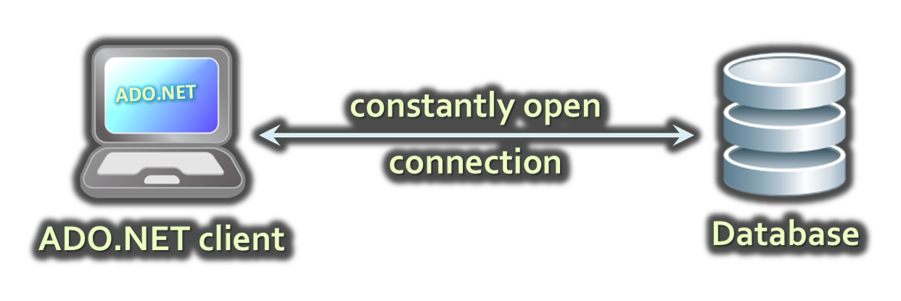

# Connected Model: Benefits and Drawbacks
*   `Connected data access model` (`SqlClient`)
    *   Benefits:
        *   Concurrency control is easier to maintain
        *   Better chance to work with the most recent version of the data
    *   Drawbacks:  
        *   Needs a constant reliable network
        *   Problems when scalability is an issue

<!-- attr: { id:'disconnected-model', hasScriptWrapper:true } -->
# Disconnected Model
*   Disconnected data access model (DataSet)
    *   A subset of the central database is copied locally at the client and he works with the copy
    *   Database synchronization is done offline
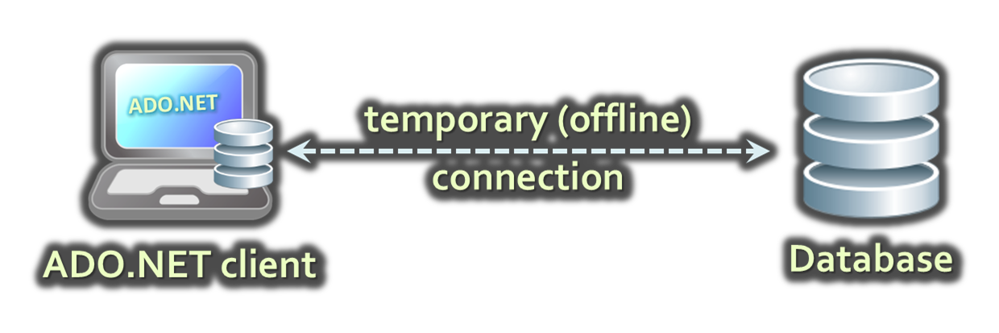
    *   Legacy technology (deprecated)

# Disconnected Model: Benefits and Drawbacks
*   Benefits:
    *   The client connects to DB from time to time
        *   Works with the local copy the rest of the time
    *   Other clients can connect during that time
    *   Has superior scalability
*   Drawbacks:
    *   The data you work with is not always the latest data in the database
    *   Additional efforts to resolve the conflicts caused by different versions of the data

<!-- attr: { id:'orm-model', hasScriptWrapper:true } -->
# ORM Model
*   `Object-Relational Mapping data access model` (Entity Framework)
    *   Maps database tables to classes and objects
    *   Objects can be automatically persisted in the database
    *   Can operate in both connected and disconnected models
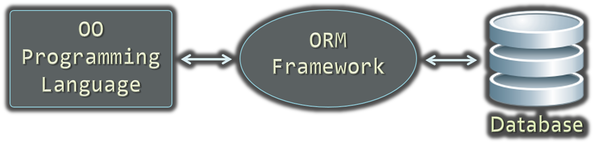

# ORM Model – Benefits and Problems
*   ORM model benefits
    *   Increased productivity – writing less code
    *   Use objects with associations instead of tables and SQL commands
    *   Integrated object query mechanism
*   ORM model drawbacks:
    *   Less flexibility
        *   SQL is automatically generated
    *   Performance issues (sometimes)

<!-- section start -->
<!-- attr: { id:'ado.net-architecture', class:'slide-section', hasScriptWrapper:true } -->
# ADO.NET Architecture <!-- .element; style="margin-top:7%" -->
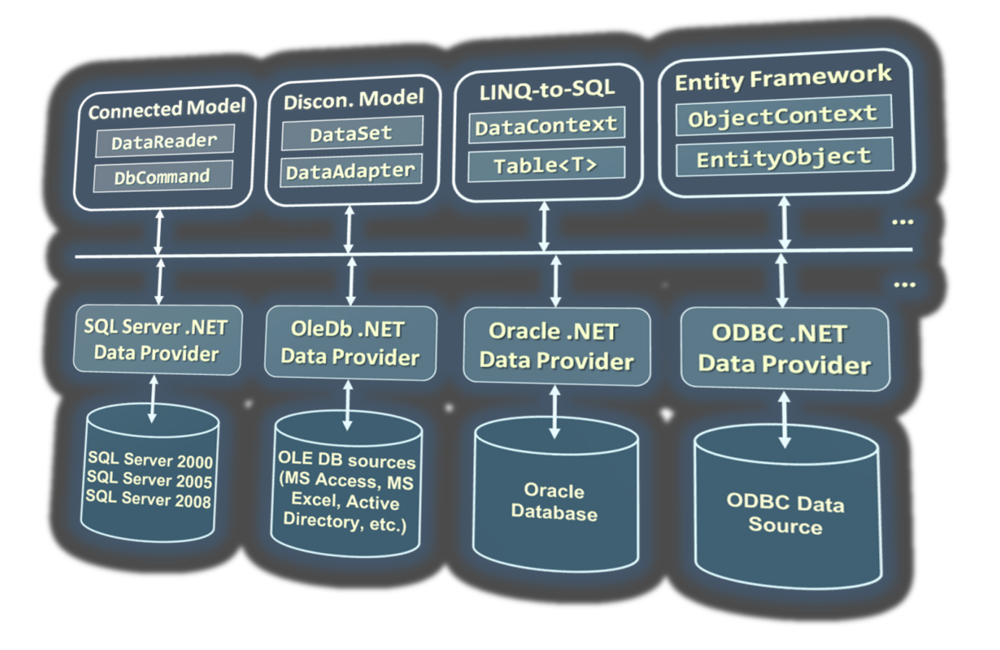

# What Is ADO.NET?
*   `ADO.NET` is a standard .NET class library for accessing databases, processing data and XML
    *   A program model for working with data in .NET
    *   Supports connected, disconnected and ORM data access models
    *   Excellent integration with LINQ, XML and WCF
    *   Allows executing SQL in RDBMS systems
        *   DB connections, data readers, DB commands
    *   Allows accessing data in the ORM approach
        *   LINQ-to-SQL and ADO.NET Entity Framework

# Namespaces In ADO.NET
*   `System.Data`
    *   ADO.NET core classes
*   `System.Data.Common`
    *   Common classes for all ADO.NET technologies
*   `System.Data.Linq`
    *   LINQ-to-SQL framework classes
*   `System.Data.Entity`
    *   Entity Framework classes
*   `System.Xml`
    *   XML processing classes

<!-- attr: { hasScriptWrapper:true } -->
# Components of ADO.NET
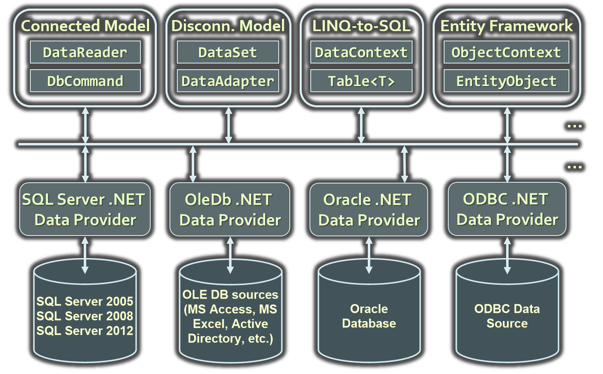

<!-- attr: { id:'data-providers-in-ado.net' } -->
# Data Providers In ADO.NET
*   `Data Providers` are collections of classes that provide access to various databases
    *   For different RDBMS systems different Data Providers are available
        *   Each provider uses vendor-specific protocols to talk to the database server
    *   Several common objects are defined:
        *   `Connection` – to connect to the database
        *   `Command` – to run an SQL command
        *   `DataReader` – to retrieve data

# Data Providers in ADO.NET
*   Several standard ADO.NET Data Providers come as part of .NET Framework
    *   `SqlClient` – accessing SQL Server
    *   `OleDB` – accessing standard OLE DB data sources
    *   `Odbc` – accessing standard ODBC data sources
    *   `Oracle` – accessing Oracle database
*   Third party Data Providers are available for:
    *   MySQL, PostgreSQL, Interbase, DB2, SQLite
    *   Other RDBMS systems and data sources
        *   SQL Azure, Salesforce CRM, Amazon SimpleDB, …

# Data Provider Classes
*   `System.Data.SqlClient` and `System.Data.SqlTypes`
    *   Data Provider classes for accessing SQL Server
*   `System.Data.OleDb`
    *   Classes for accessing OLE DB data sources
*   `System.Data.Odbc`
    *   Classes for accessing ODBC data sources
*   `System.Data.Oracle`
    *   Classes for accessing Oracle databases

<!-- attr: { id:'primary-provider-classes-and-interfaces-in-ado.net', hasScriptWrapper:true } -->
# Primary Provider Classes and Interfaces in ADO.NET
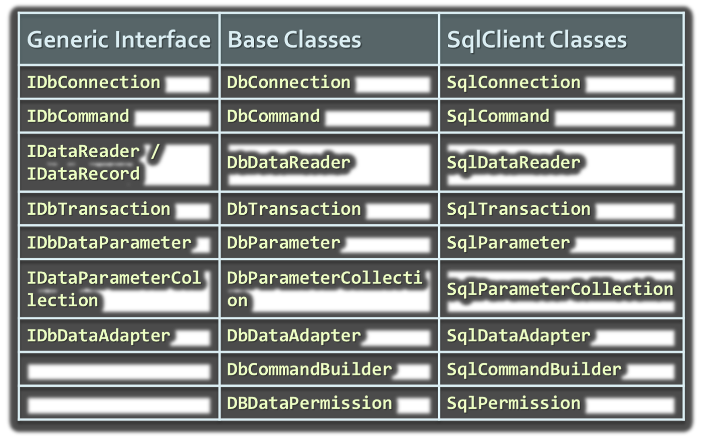

<!-- section start -->
<!-- attr: { id:'connecting-to-sql-server', class:'slide-section' } -->
# Connecting to SQL Server
## Accessing SQL Server from ADO.NET (Connected Model)

<!-- attr: { style:'font-size:0.9em', hasScriptWrapper:true } -->
# ADO.NET: Connected Model
<div style="width:50%">
*   Retrieving data in `connected model`
    1.  Open a connection (`SqlConnection`)
    1.  Execute command (`SqlCommand`)
    1.  Process the result set of the query by using a reader (`SqlDataReader`)
    1.  Close the reader
    1.  Close the connection
</div>
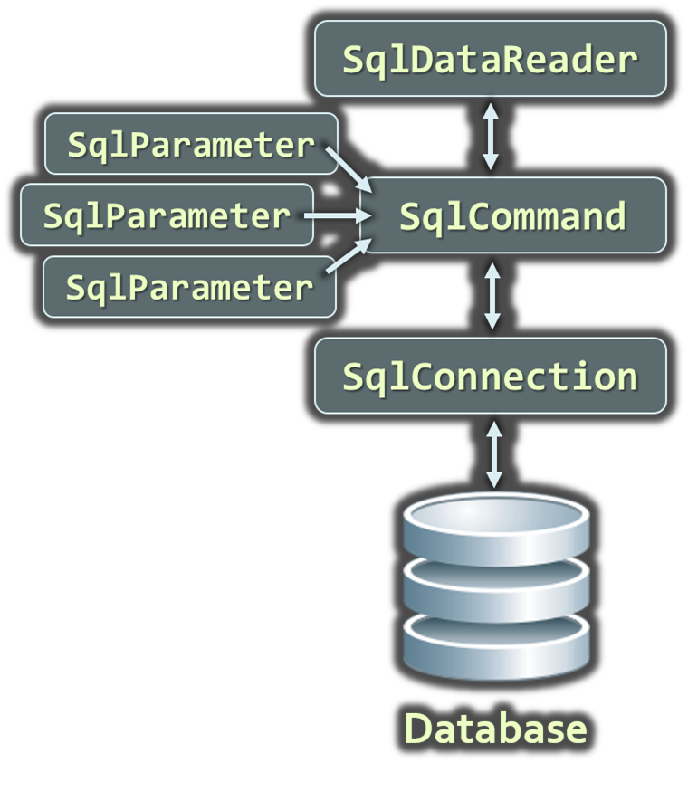

<!-- attr: { style:'font-size:0.9em', hasScriptWrapper:true } -->
# ADO.NET: Disconnected Model
<div style="width:55%">
*   Disconnected model: the data is cached in a `DataSet`
    1.  Open a connection (`SqlConnection`)
    1.  Fill a DataSet (using `SqlDataAdapter`)
    1.  Close the connection
    1.  Modify the `DataSet`
    1.  Open a connection
    1.  Update changes into the DB
    1.  Close the connection
</div>
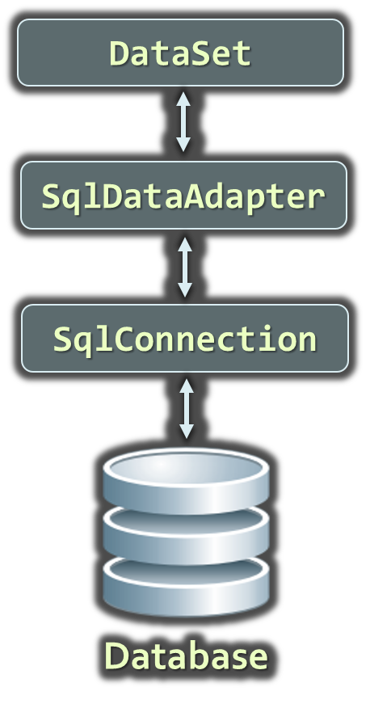
*   Warning: DataSets / DataAdapters are legacy technology (not in use since .NET 3.5) <!-- .element; class="fragment balloon" style="left:50%; top:60%" -->

<!-- attr: { style:'font-size:0.9em', hasScriptWrapper:true } -->
# ADO.NET: LINQ-to-SQL
<div style="width:55%">
*   `LINQ-to-SQL` is ORM framework for SQL Server
    1.  Create object models mapping the database
    1.  Open a data context
    1.  Retrieve data with LINQ / modify the tables in the data context
    1.  Persist the data context changes into the DB
    1.  Connection is auto-closed
</div>
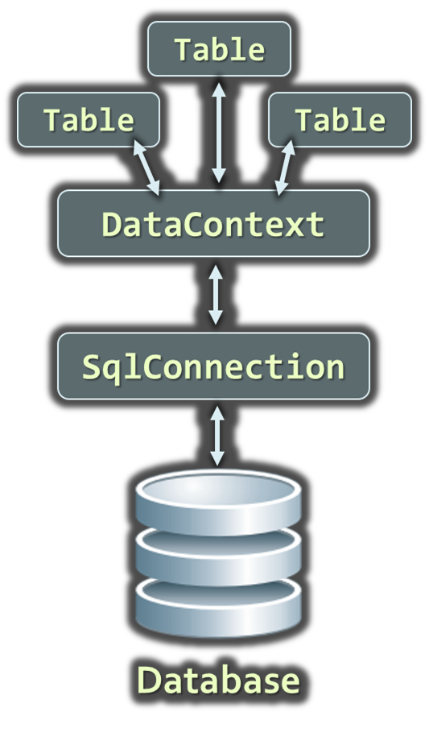

<!-- attr: { style:'font-size:0.9em', hasScriptWrapper:true } -->
# ADO.NET: Entity Framework
<div style="width:55%">
*   `Entity Framework` is generic ORM framework
    1.  Create entity data model mapping the database
    1.  Open an object context
    1.  Retrieve data with LINQ / modify the tables in the object context
    1.  Persist the object context changes into the DB
    1.  Connection is auto-closed
</div>
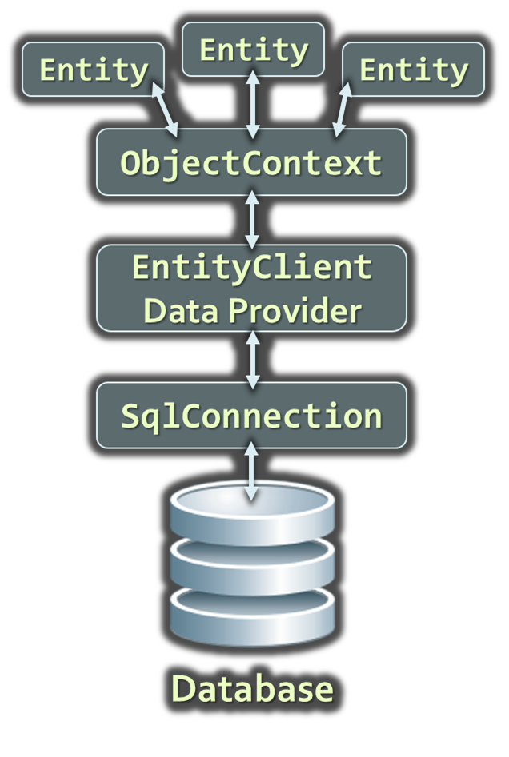

<!-- attr: { id:'sql-client-data-provider', class:'slide-section' } -->
# SQL Client Data Provider

# SqlClient Data Provider
*   `SqlConnection`
    *   Establish database connection to SQL Server 
*   `SqlCommand`
    *   Executes SQL commands on the SQL Server through an established connection
    *   Could accept parameters (`SQLParameter`)
*   `SqlDataReader`
    *   Retrieves data (record set) from SQL Server as a result of SQL query execution

# The SqlConnection Class
*   `SqlConnection` establish connection to SQL Server database
    *   Requires a valid connection string
*   Connection string example:

```xml
Data Source=(local)\SQLEXPRESS;Initial Catalog=Northwind;
Integrated Security=SSPI;
```
*   Connecting to SQL Server:

```cs
SqlConnection con = new SqlConnection(
  "Server=.\SQLEXPRESS;Database=Northwind;
   Integrated Security=true");
con.Open();
```

# DB Connection String
*   `Database connection string`
    *   Defines the parameters needed to establish the connection to the database
*   Settings for SQL Server connections:
    *   `Provider` – name of the DB driver
    *   `Data Source` / `Server` – server name / IP address + database instance name
    *   `Database` / `Initial Catalog` – database name
    *   `User ID` / `Password` – credentials

# DB Connection String
*   Settings for SQL Server connections:
    *   `AttachDbFilename=some_db.mdf`
        *   Attaches a local database file
        *   Supported by SQL Express only
    *   `Server=server_name\database_instance`
        *   "`.`" or "`(local)`" or "`SOME_SERVER`"
        *   Database instance is "`MSSQL`", "`SQLEXPRESS`" or other SQL Server instance name
    *   `Integrated Security` – true / false

# Connection Pooling
*   By default SqlClient Data Provider uses `connection pooling` for improved performance
*   Connection pooling works as follows:
    *   When establishing a connection an existing one is taken from the so called "connection pool"
        *   If there is no free connection in the pool, a new connection is established
    *   When closing a connection it is returned to the pool, instead of being closed

# Working with SqlConnection
*   Explicitly opening and closing a connection
    *   `Open()` and `Close()` methods
    *   Works through the connection pool
*   DB connections are `IDisposable` objects
    *   Always use the `using` construct in C#!
*   Implicitly opening and closing the connection
    *   Done automatically by `DataAdapters`, `DataContexts` and `ObjectContexts`
    *   EF opens / closes the DB connection implicitly

<!-- attr: { hasScriptWrapper:true } -->
# ADO.NET Classes for the Connected Model
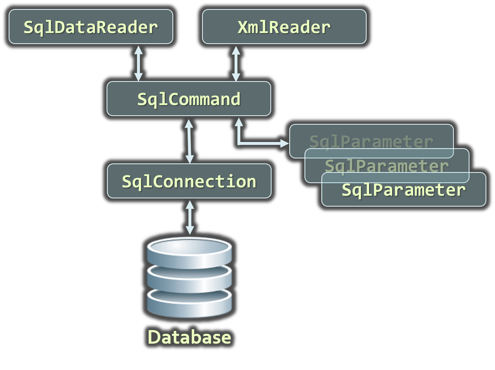


<!-- attr: { style:'font-size:0.85em' ,hasScriptWrapper:true } -->
# SqlClient and ADO.NET Connected Model
<div style="width:60%">
*   Retrieving data in connected model
    1.  Open a connection (`SqlConnection`)
    1.  Execute command (`SqlCommand`)
    1.  Process the result set of the query by using a reader (`SqlDataReader`)
    1.  Close the reader
    1.  Close the connection
</div>


<!-- attr: { id:'the-sqlcommand-class', style:'font-size:0.95em' } -->
# The SqlCommand Class
*   Executes an SQL statement or a stored procedure
*   More important properties
    *   `Connection` – gets / sets the `SqlConnection` of the command
    *   `CommandType` – the type of the command
        *   `CommandType.StoredProcedure`
        *   `CommandType.TableDirect`
        *   `CommandType.Text`
    *   `CommandText` – the body of the SQL query or the name of the stored procedure
    *   `Parameters`

# The SqlCommand Class
*   More important methods
    *   `ExecuteScalar()`
        *   Returns a single value (the value in the first column of the first row of the result set)
        *   The returned value is `System.Object` but can be casted to the actual returned data type
    *   `ExecuteReader()`
        *   Returns a `SqlDataReader`
            *   It is a cursor over the returned records (result set)
    *   `CommandBehavior` – assigns some options

# The SqlCommand Class
*   More important methods
    *   `ExecuteNonQuery()`
        *   Used for non-query SQL commands, e.g. `INSERT`
        *   Returns the number of affected rows (`int`)
    *   `ExecuteXmlReader()`
        *   Returns the record set as XML
        *   Returns an `XmlReader`
        *   Supported in SqlClient Data Provider only

<!-- attr: { style:'font-size:0.95em' } -->
# The SqlDataReader Class
*   `SqlDataReader` retrieves a sequence of records (cursor) returned as result of an SQL command
    *   Data is available for reading only (can't be changed)
    *   Forward-only row processing (no move back)
*   Important properties and methods:
    *   `Read()` – moves the cursor forward and returns `false` if there is no next record
    *   `Item` (indexer) – retrieves the value in the current record by given column name or index
    *   `Close()` – closes the cursor and releases resources

# SqlCommand – Example
```cs
SqlConnection dbCon = new SqlConnection(
  "Server=.\\SQLEXPRESS; " +
  "Database=TelerikAcademy; " +
  "Integrated Security=true");
dbCon.Open();

using(dbCon)
{
  SqlCommand command = new SqlCommand(
    "SELECT COUNT(*) FROM Employees", dbCon);
  int employeesCount = (int) command.ExecuteScalar();
  Console.WriteLine("Employees count: {0}", employeesCount);
}
```

# SqlDataReader – Example
```cs
SqlConnection dbCon = new SqlConnection(…);
dbCon.Open();
using(dbCon)
{
  SqlCommand command = new SqlCommand(
    "SELECT * FROM Employees", dbCon);
  SqlDataReader reader = command.ExecuteReader();
  using (reader)
  {
    while (reader.Read())
    {
      string firstName = (string)reader["FirstName"];
      string lastName = (string)reader["LastName"];
      decimal salary = (decimal)reader["Salary"];
      Console.WriteLine("{0} {1} - {2}",
        firstName, lastName, salary);
    }
  }
}
```

<!-- attr: { class:'slide-section' } -->
# Using SqlCommand and SqlDataReader
## Live Demo

<!-- section start -->
<!-- attr: { id:'sql-injection', class:'slide-section' } -->
# SQL Injection
## What is SQL Injection and How to Prevent It?

# What is SQL Injection?
```cs
bool IsPasswordValid(string username, string password)
{
  string sql = 
    "SELECT COUNT(*) FROM Users " +
    "WHERE UserName = '" + username + "' and " +
    "PasswordHash = '" + CalcSHA1(password) + "'";
  SqlCommand cmd = new SqlCommand(sql, dbConnection);
  int matchedUsersCount = (int) cmd.ExecuteScalar();
  return matchedUsersCount > 0;
}

bool normalLogin = 
  IsPasswordValid("peter", "qwerty123"); // true
bool sqlInjectedLogin = 
  IsPasswordValid(" ' or 1=1 --", "qwerty123"); // true
bool evilHackerCreatesNewUser = IsPasswordValid(
  "' INSERT INTO Users VALUES('hacker','') --", "qwerty123");
```

<!-- attr: { style:'font-size:0.9em' } -->
# How Does SQL Injection Work?
*   The following SQL commands are executed:
    *   Usual password check (no SQL injection):

```sql
SELECT COUNT(*) FROM Users WHERE UserName = 'peter'
 and PasswordHash = 'XOwXWxZePV5iyeE86Ejvb+rIG/8='
```
*   SQL-injected password check:

```sql
SELECT COUNT(*) FROM Users WHERE UserName = ' ' or 1=1 -- '
 and PasswordHash = 'XOwXWxZePV5iyeE86Ejvb+rIG/8='
```
*   SQL-injected INSERT command:

```sql
SELECT COUNT(*) FROM Users WHERE UserName = ''
INSERT INTO Users VALUES('hacker','')
--' and PasswordHash = 'XOwXWxZePV5iyeE86Ejvb+rIG/8='
```

<!-- attr: { class:'slide-section' } -->
# SQL Injection
## Live Demo

# Preventing SQL Injection
*   Ways to prevent the SQL injection:
    *   SQL-escape all data coming from the user:

```sql
string escapedUsername = username.Replace("'", "''");
string sql = "SELECT COUNT(*) FROM Users " +
    "WHERE UserName = '" + escapedUsername + "' and " +
    "PasswordHash = '" + CalcSHA1(password) + "'";
```
*   _Not recommended_: use as last resort only!
*   Preferred approach:
    *   Use `parametrized queries`
    *   Separate the SQL command from its arguments

<!-- attr: { id:'the-sqlparameter-class' } -->
# The SqlParameter Class
*   What are `SqlParameters`?
    *   SQL queries and stored procedures can have input and output parameters
    *   Accessed through the `Parameters` property of the `SqlCommand` class
*   Properties of `SqlParameter`:
    *   `ParameterName` – name of the parameter
    *   `DbType` – SQL type (`NVarChar`, `Timestamp`, …)
    *   `Size` – size of the type (if applicable)
    *   `Direction` – input / output

# Parameterized Commands – Example
```cs
private void InsertProject(string name, string description, 
  DateTime startDate, DateTime? endDate)
{
  SqlCommand cmd = new SqlCommand("INSERT INTO Projects " + 
    "(Name, Description, StartDate, EndDate) VALUES " +
    "(@name, @desc, @start, @end)", dbCon);
  cmd.Parameters.AddWithValue("@name", name);
  cmd.Parameters.AddWithValue("@desc", description);
  cmd.Parameters.AddWithValue("@start", startDate);
  SqlParameter sqlParameterEndDate = 
    new SqlParameter("@end", endDate);
  if (endDate == null)
    sqlParameterEndDate.Value = DBNull.Value;
  cmd.Parameters.Add(sqlParameterEndDate);
  cmd.ExecuteNonQuery();
}
```

<!-- attr: { style:'font-size:0.95em'} -->
# Primary Key Retrieval
*   Retrieval of an automatically generated primary key is specific to each database server
*   In MS SQL Server `IDENTITY` column is used
    *   Obtained by executing the following query:

```sql
SELECT @@Identity
```
*   Example of obtaining the automatically generated primary key in ADO.NET:

```cs
SqlCommand selectIdentityCommand = 
    new SqlCommand("SELECT @@Identity", dbCon);
int insertedRecordId = (int)
  (decimal) selectIdentityCommand.ExecuteScalar();
```

<!-- attr: { class:'slide-section' } -->
# Parameterized Queries
## Live Demo


<!-- section start -->
<!-- attr: { id:'connecting-to-non-microsoft-databases', class:'slide-section' } -->
# Connecting to Non-Microsoft Databases

# Connecting to Non-Microsoft Databases
*   ADO.NET supports accessing various databases via their Data Providers:
    *   `OLE DB` – supported internally in ADO.NET
        *   Access any OLE DB-compliant data source
        *   E.g. MS Access, MS Excel, MS Project, MS Exchange, Windows Active Directory, text files
    *   `Oracle` – supported internally in ADO.NET
    *   `MySQL` – third party extension
    *   `PostgreSQL` – third party extension

# ADO.NET Data Interfaces
*   ADO.NET Data Providers implement the following interfaces:
    *   `IDbConnection`
    *   `IDbCommand`, `IDataParameter`
    *   `IDataReader`
    *   `IDbDataAdapter`

# ADO.NET Base Classes
*   ADO.NET provides the following base classes:
    *   `DbConnection`
    *   `DbCommand` / `DbParameter`
    *   `DbDataReader`
    *   `DbTransaction`
    *   `DbParameterCollection`
    *   `DbDataAdapter`
    *   `DbCommandBuilder`
    *   `DbConnectionStringBuilder`
    *   `DBDataPermission`

<!-- attr: { id:'ole-db-data-provider' } -->
# OLE DB Data Provider
*   `OleDbConnection` – establishes a connection to an OLE DB source of data

```cs
OleDbConnection dbConn = new OleDbConnection(
  @"Provider=Microsoft.Jet.OLEDB.4.0;Data
  Source=C:\MyDB.mdb;Persist Security Info=False");
```
*   `OleDbCommand` – executes an SQL commands through an OLE DB connection to a DB
*   `OleDbParameter` – parameter for a command
*   `OleDbDataReader` – to retrieve data from a command, executed through OLE DB

<!-- attr: { hasScriptWrapper:true } -->
# Connecting To OLE DB – Example
*   Suppose we have MS Access database `C:\Library.mdb`
*   We have the table `Users`:
*   We use the "Microsoft Jet 4.0 Provider" to connect in ADO.NET through OLE DB
*   We create a connection string component:

```xml
Provider=Microsoft.Jet.OLEDB.4.0;
Data Source=C:\Library.mdb;Persist Security Info=False
```
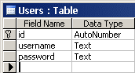

<!-- attr: { class:'slide-section' } -->
# Connecting to MS Access Database
## Live Demo

<!-- attr: { id:'connecting-to-mysql', class:'slide-section' } -->
# Connecting to MySQL
## Accessing MySQL from ADO.NET

# Connecting to MySQL from C#
*   Download and install
    *   [MySQL Connector/Net](http://dev.mysql.com/downloads/connector/net/)
*   Add reference to `MySQL.Data.dll`
    *   Available also from NuGet
        *   see http://nuget.org/packages/Mysql.Data/
*   Connecting to MySQL:

```cs
MySqlConnection dbConnection = new MySqlConnection(
  "Server=localhost; Port=3306; Database=world;
  Uid=root; Pwd=root; pooling=true");
```

<!-- attr: { class:'slide-section' } -->
# Connecting to MySQL
## Live Demo


<!-- section start -->
<!-- attr: { id:'working-with-dates-and-images', class:'slide-section' } -->
# Working with Dates and Images
## Best Practices

# Working with Dates: Best Practices
*   Use the date-specific types in the database and never `varchar` / `nvarchar`
*   Some databases support more than one type for storing dates
    *   Two types in MS SQL Server
        *   `datetime` (8 bytes)
        *   `smalldatetime` (4 bytes)
*   When working with dates use string only when displaying the date to the user

# Working with Dates: Best Practices
*   Use the `System.DateTime` structure to work with dates in .NET
*   Use parameterized queries to pass the dates to the database
*   If you need to convert use `IFormatProvider` to define the rules for the conversion
*   When needed use the neutral culture settings: `CultureInfo.InvariantCulture`

# Working with Dates – Example

```sql
CREATE TABLE Messages
(
  MsgId int identity not null primary key,
  MsgText nvarchar(1000),
  MsgDate datetime –- Don’t use varchar for dates!
)
```
```cs
public void AddMsg(string text, DateTime date)
{
  SqlCommand cmdInsertMsg = new SqlCommand(
    "INSERT INTO Messages(MsgText, MsgDate) " +
    "VALUES (@MsgText, @MsgDate)", dbCon);
  cmdInsertMsg.Parameters.AddWithValue(
    "@MsgText", text);
  cmdInsertMsg.Parameters.AddWithValue(
    "@MsgDate", date);
  cmdInsertMsg.ExecuteNonQuery();
}
```

<!-- attr: { class:'slide-section' } -->
# Working With Dates
## Live Demo

# Storing Images in the DB
*   Store images in the `file system` or in the `DB`?
    *   Have a good reason to use the DB!
*   DB field types for large binary objects:
    *   Type "`image`" in MS SQL Server
    *   Type "`blob`" in Oracle
    *   Type "`OLE Object`" in MS Access
*   Map the `image` columns to `byte[]`
    *   When the files are large, use stream-based access to the binary database fields

<!-- attr: { class:'slide-section' } -->
# Images in the Database
## Live Demo

<!-- section start -->
<!-- attr: { id:'questions', class:'slide-section' } -->
# Questions
## ADO.NET
[go to Telerik Academy forum](http://telerikacademy.com/Forum/Tag/ado)
