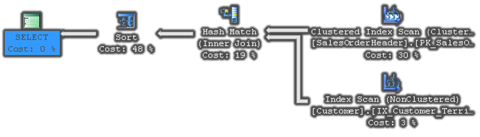
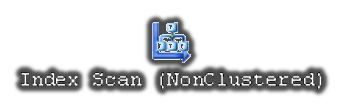
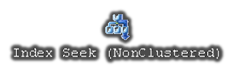
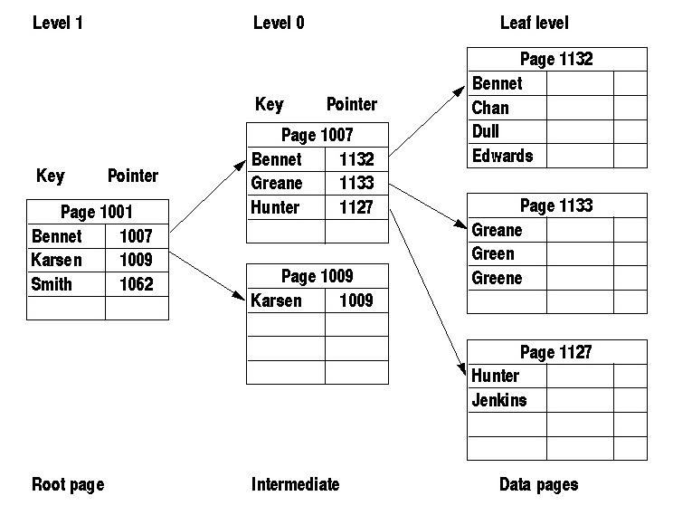
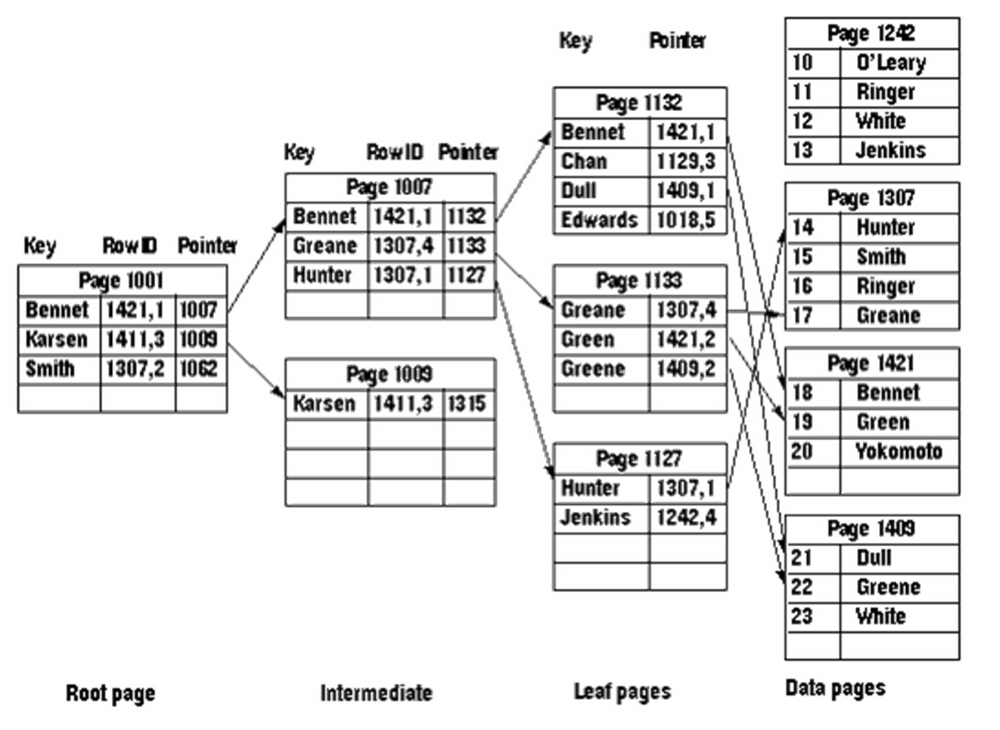
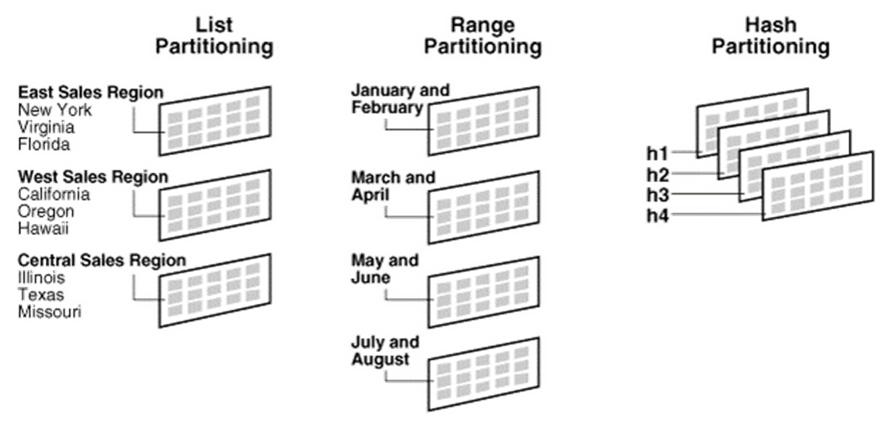
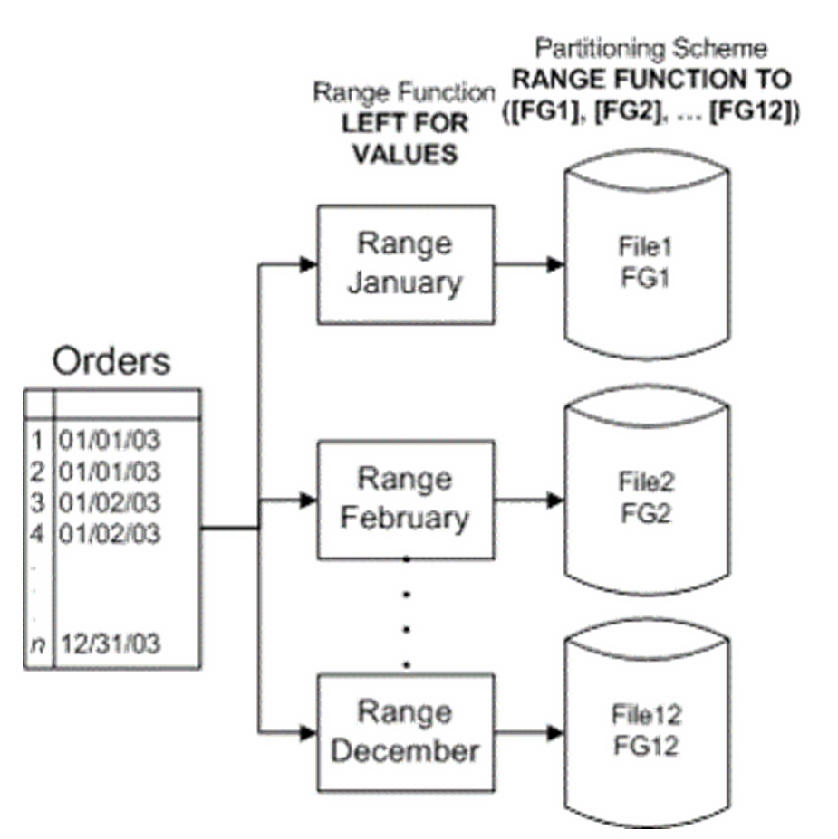

<!-- section start -->

<!-- attr: {id: 'title', class: 'slide-title', hasScriptWrapper: true} -->

# Database Performance
## Database Performance for Developers
<div class="signature">
    <p class="signature-course">Databases</p>
    <p class="signature-initiative">Telerik Software Academy</p>
    <a href="http://academy.telerik.com" class="signature-link">http://academy.telerik.com</a>
</div>

<!-- section start -->
<!-- attr: {id: 'table-of-contents', class:'table-of-contents'} -->
# Table of Contents
* [DB Performance Factors](#db-performance)
* [Query Execution Plans](#query-execution-plans)
  * Operations and Costs: Table Scan, Nested Loops, Index Seek, Clustered Index Seek, Merge Join, Hash Join, Sort, Hash Match, …
* [Table Indexes](#indexes)
  * Clustered Indexes and Non-Clustered Indexes
* [Caching SQL Query Results](#caching-sql-query-results)
* [Table Partitioning in MySQL](#table-partitioning-concepts)

<!-- section start -->
<!-- attr: { id:'db-performance', class:'slide-section', showInPresentation:true } -->
<!-- # Database Performance Factors
## Overview -->

# DB Performance
* DB performance depends on many factors:
  * `Hardware`
    * CPU & RAM
    * Storage, drives, RAID arrays
    * SSD drives boost I/O performance
  * `Operating system configuration`
    * Services -> turn off unused services
    * Drivers -> use high-performance devices drivers
    * Network configuration -> maximize throughput
    * Virtual memory -> `pagefile.sys` on separate HDD

<!-- attr: { showInPresentation:true } -->
<!-- # DB Performance -->
* DB performance depends on many factors:
  * SQL Server version  
    * Standard Edition – 64 GB RAM, 16 cores
    * Enterprise Edition –  Operating system maximum
    * Some features are included in enterprise
  * SQL Server configuration
    * Configure database storage and files
    * Configure `tempdb` size and location
    * Not using Microsoft`s defaults
    * Reinitialize indexes and table fill factor (weekly)
    * Update statistics and sysindexes (nightly)

<!-- attr: { showInPresentation:true } -->
<!-- # DB Performance
* DB performance depends on many factors: -->
  * `Database design`
    * Schema normalization (3rd & 4th normal form?)
    * Data types
    * Indexes
    * Constraints - SQL Server uses them
    * Triggers - row by row operation = slow
    * Indexed views
    * Table partitioning
    * Physical storage settings
    * Clustering
    
<!-- attr: { showInPresentation:true } -->
<!-- # DB Performance
* DB performance depends on many factors: -->
  * `Query tuning`
    * Efficient SQL
    * Proper index usage
    * Optimize physical I/O (real hard disk operations)
  * `Stored procedures tuning`
  * `Application design`
    * E.g. ORM framework, caching, query efficiency, N+1 query problem, batch operations, transactions, etc.

<!-- section start -->
<!-- attr: { id:'query-execution-plans', class:'slide-section', showInPresentation:true } -->
<!-- # Query Execution Plans
## How to Analyse Query Execution Plans? -->

# Query Execution Plans
* *How the query optimizer decides to execute your query*
* `Execution Plans` visualize these steps ([Icons](https://msdn.microsoft.com/en-us/library/ms175913.aspx))
* Some steps could be complex, consisting of several sub-steps (like an expression tree)
* Two types of plans: Estimated and Actual
* Plans are also cached for reuse

<!-- attr: { hasScriptWrapper:true, style:'font-size:0.95em' } -->
# Execution Plan: Example
* Consider the following SQL query:

```sql
SELECT c.CustomerID, soh.SalesOrderID, soh.OrderDate
FROM Sales.Customer c JOIN Sales.SalesOrderHeader soh
  ON c.CustomerID = soh.CustomerID
WHERE soh.OrderDate > '20040101'
ORDER BY soh.OrderDate DESC
```

* Its execution plan might be as follows:



* Read the plans from right-to-left and top-to-bottom

<!-- attr: { hasScriptWrapper:true, style:'font-size:0.85em' } -->
# Query Operations
* `Clustered Index Scan` – O(n) operation 
  * Walks through the B-Tree clustered index
  * The data is sorted by the clustered-index key

                                                         
* `Index Scan` – O(n) operation                          
  * Walks through the B-Tree index                       

                                                         
* `Index Seek` – O(log(n)) operation                     
  * Similar performance like `Clustered Index Seek`      

                                                         
* `Key Lookup` – O(1) operation                          
  * Finds a table record by its ID (read a record)


<!-- attr: { hasScriptWrapper:true } -->
# Join Operations
* `Nested Loops` – O (n*m) operation
  * Nested “for each row…” operation


* `Merge Join` – O (n + m) operation
  * Scans both sides of join in parallel 
  * Ideal for large range scans
  * No sort is required when both columns are indexed


* `Hash Join` – O (n + m) operation
  * “Hashes” the join column/s from one side of join
  * “Probes” with the other side (the larger)


<!-- attr: { class:'slide-section table-of-contents', showInPresentation:true } -->
<!-- # Query Execution Plans -->
## [Demo]()

<!-- section start -->
<!-- attr: { id:'indexes', class:'slide-section', showInPresentation:true} -->
<!-- # Table Indexes
## Clustered and Non-Clustered Indexes -->

# Indexes
* `Indexes` speed up searching of values in a certain column or group of columns
  * Provide fast data access in `log(N)` steps
  * Usually implemented as B-trees
    * SQL Server 2012 introduces `Columnstore` indexes
* Insert / update / delete of records in indexed tables is slower!
  * Useful for big tables (50 000+ rows)
* Indexes can be built-in the table (`clustered`) or stored externally (`non-clustered`)

<!-- attr: { style:'font-size:0.95em' } -->
# Clustered Indexes
* `Clustered indexes` are the actual physically written records
  * An index built-in the table as B-tree – very fast!
  * A `SELECT` statement with no `ORDER BY` clause will return data in the clustered index order
  * Highly recommended for every table!
  * Very useful for fast execution of `WHERE`, `ORDER BY` and `GROUP BY` clauses
* Maximum 1 clustered index per table
  * If a table has no clustered index, its data rows are stored in an unordered structure (heap)

<!-- attr: { hasScriptWrapper:true } -->
# Clustered Index: Structure


# Non-Clustered Indexes
* `Non-Clustered Indexes`
  * Useful for fast retrieving a single record or a range of records
  * Maintained in a separate structure in the DB
  * Tend to be much narrower than the base table
    * Can locate the exact record(s) with less I/O
  * Has at least one more intermediate level than the clustered index
    * Much less valuable if table doesn’t have a clustered index

<!-- attr: { hasScriptWrapper:true } -->
# Non-Clustered Index: Structure


<!-- attr: { hasScriptWrapper:true } -->
# Full-Text Indexes
1.  Full-Text Search in SQL Server
  * Allows full-text queries against character-based data in SQL Server table
  * It splits the text into words and indexes them
1.  Create a Full-Text Catalog
1.  Create a Full-Text Index for the tables and columns you want to search
1.  The index is populated in background
1.  Use `WHERE CONTAINS(<column>, 'text')`

# Add Index When
* You need `fast access by some column` or group of columns
  * Unless the records are less than 1 000
* Search by certain column/s (`WHERE` clause)
* Data within the column is used to build joins
  * `Foreign keys` are almost always good candidates for indexes
* You need to scan large tables fast (millions of records) - `Columnstore`

# How Many Indexes?
* Adding non-clustered indexes to a table can greatly speed-up SELECT statements
* Every index has a certain amount of overhead
  * The greater the number of indexes, the more overhead with every INSERT, UPDATE and DELETE
* Must balance the needs of the application with the pros and cons of added indexes
  * OLTP -> less indexes (more modify, less read)
    * Online Transaction Processing (Standard DB)
  * OLAP -> more indexes (more read, less modify)
    * Online Analytical Processing (Data Warehouse)

# Fill Factor
* When SQL Server creates indexes, every page is nearly 100% full
  * No room on the leafs or intermediate pages for INSERTs, UPDATEs, or DELETEs
  * The default (100%) can cause costly page splits on certain tables
  * Promotes table fragmentation
* You can specify amount of free space in leaf pages with `FILLFACTOR` (prefer 75-80%)
  * An option in the `CREATE INDEX`
  * Small `FILLFACTOR` may cause performance issues – bigger pages = more data in cache

<!-- attr: { class:'slide-section table-of-contents', showInPresentation:true } -->
<!-- # Table Indexes -->
## [Demo]()

<!-- section start -->
<!-- attr: { id:'caching-sql-query-results', class:'slide-section', showInPresentation:true} -->
<!-- # Caching SQL Query Results
## Using Cache Table for Improved Performance -->

# Caching SQL Query Results
* Caching can significantly improve the performance of heavy joins
  * E.g. joining 8 tables is slower than scanning an already pre-computed (de-normalized) table
  * Can be done at application or at DB level
* Caching SQL query results at database level
  * Just insert the SQL results into a cache-table
  * Update the cache at certain time interval
    * May be automated through a scheduled job

<!-- attr: { showInPresentation:true, style:'font-size:0.9em' } -->
<!-- # Caching SQL Query Results -->
* Creating a cache-table:

```sql
CREATE TABLE CacheOfMsgCheapJan2012(
  MsgId int PRIMARY KEY,
  MsgDate datetime,
  MsgPrice int,
  AuthorName varchar(100))
```

* Rebuilding the cache:

```sql
BEGIN TRANSACTION
DELETE FROM CacheOfMsgCheapJan2012
INSERT INTO CacheOfMsgCheapJan2012
SELECT m.MsgId, m.MsgDate, m.MsgPrice, a.AuthorName
FROM dbo.Messages m JOIN dbo.Authors a 
  ON m.AuthorId = a.AuthorId
AND m.MsgDate BETWEEN '1-Jan-2012' AND '31-Jan-2012'
AND m.MsgPrice < 100000
COMMIT
```

<!-- attr: { class:'slide-section table-of-contents', showInPresentation:true } -->
<!-- # Caching SQL Query Results -->
## [Demo]()

<!-- section start -->
<!-- attr: { id:'table-partitioning-concepts', class:'slide-section', showInPresentation:true} -->
# Table Partitioning
## Overview

<!-- attr: { hasScriptWrapper:true } -->
# Table Partitioning Concepts
* Partitioning is a physical split of a large table into several pieces by some criteria



<!-- attr: { hasScriptWrapper:true } -->
# Table Partitioning - Example



<!-- attr: { style:'font-size:0.9em' } -->
# Partitioning in MySQL
* Partitioning by hash code:

```sql
CREATE TABLE Messages(
  MsgId int NOT NULL AUTO_INCREMENT,
  AuthorId int NOT NULL,
  MsgText nvarchar(300),
  MsgDate datetime,
  PRIMARY KEY (MsgId, AuthorId)
) PARTITION BY HASH(AuthorId) PARTITIONS 5;
```

* Partitioning by range:

```sql
CREATE TABLE Messages( … )) 
PARTITION BY RANGE(YEAR(MsgDate)) (
   PARTITION p0 VALUES LESS THAN (1990),
   PARTITION p2 VALUES LESS THAN (2000),
   PARTITION p4 VALUES LESS THAN MAXVALUE
);
```

<!-- attr: { class:'slide-section table-of-contents', showInPresentation:true } -->
<!-- # Partitioning in MySQL -->
## [Demo]()

<!-- section start -->
<!-- attr: { id:'questions', class:'slide-section', showInPresentation:true } -->
<!-- # Questions
## Database Performance -->
