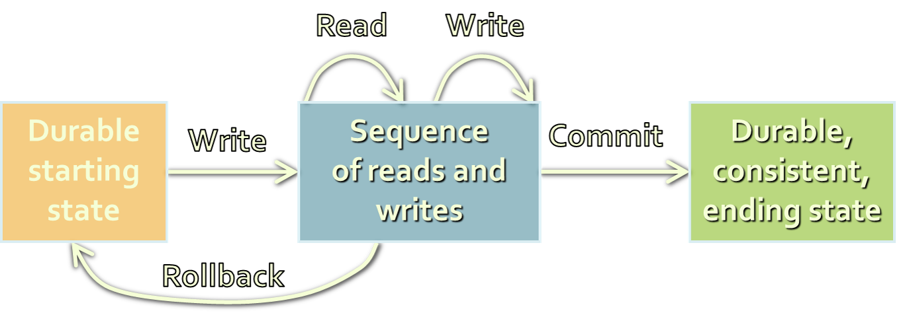

<!-- section start -->

<!-- attr: {id: 'title', class: 'slide-title', hasScriptWrapper: true} -->
# Database Transaction Concepts
## Transaction Management and Concurrency Control

<div class="signature">
    <p class="signature-course">Databases</p>
    <p class="signature-initiative">Telerik Software Academy</p>
    <a href="http://academy.telerik.com" class="signature-link">http://academy.telerik.com</a>
</div>

<!-- section start -->

<!-- attr: {id: 'table-of-contents', class:'table-of-contents'} -->
# Table of Contents

*   What is a Transaction?
*   ACID Transactions
*   Managing Transactions in SQL
*   Concurrency Problems in DBMS
*   Concurrency Control Techniques
    *   Locking Strategies
    *   Optimistic vs. Pessimistic Locking
*   Transaction Isolation Levels
*   Transaction Log and Recovery
*   When and How to Use Transactions?

<!-- section start -->

<!-- attr: {class: 'slide-section'} -->
#   What is a Transaction?
##  And why they are a must-have

#   Transactions

*   Transactions is a sequence of actions (database operations) executed as a whole:
    *   Either all of them complete successfully
    *   Or none of the them
* _Example_ of transaction:
    *   A bank transfer from one account into another (withdrawal + deposit)
    *   If either the withdrawal or the deposit fails the whole operation is cancelled



#   Transactions' Behavior

*   Transactions guarantee the consistency and the integrity of the database
    *   All changes in a transaction are temporary
    *   Changes are persisted when COMMIT is executed
    *   At any time all changes can be canceled by ROLLBACK
*   All of the operations are executed as a whole
    *   Either all of them or none of them

#   Transactions: Example

*   Withdraw $100
    1.   Read current balance
    *   New balance = current - $100
    *   Write new balance
    *   Dispense cash
<!-- attr: {showInPresentation: true} -->
<!-- #   Transactions: Example -->
*   Transfer $100
    *   Read savings
    *   New savings = current - $100
    *   Read checking
    *   New checking = current  + $100
    *   Write savings
    *   Write checking

#   What Can Go Wrong Without Transactions?

*   Some actions fail to complete
    *   For example, the application software or database server crashes
*   Interference from another transaction
    *   What will happen if several transfers run for the same account in the same time?
*   Some data lost after actions complete
    *   Database crashes after withdraw is complete and all other actions are lost

<!-- section start -->

<!-- attr: {class: 'slide-section'} -->
#   ACID Transactions
##    Atomicity, Consistency, Isolation, Durability

#   Transaction Properties

*   Modern DBMS servers have built-in transaction support
    *   Implement **ACID** transactions
    *   E.g. MS SQL Server, Oracle, MySQL, …

*   **ACID** means:
    *   ***A*** tomicity
    *   ***C*** onsistency
    *   ***I*** solation
    *   ***D*** urability

#   Atomicity

*   **Atomicity** means that
    *   Operations in a transaction execute as a whole
    *   DBMS to guarantee that either all of the operations are performed or none of them

*   _Atomicity example:_
    *   Transfer funds between bank accounts
        *   Either withdraw **and** deposit **both execute successfully** or none of them
        *   In case of failure the DB stays unchanged

#   Consistency

*   **Consistency** means that
    *   The database is in a legal state when the transaction begins and when it ends
    *   Only valid data will be written in the DB
    *   Transaction cannot break the rules of the database, e.g. integrity constraints
        *   Primary keys, foreign keys, alternate keys
*   _Consistency example:_
    *   Transaction cannot end with a duplicate primary key in a table

#   Isolation

*   Isolation means that
    *   Multiple transactions running at the same time do not impact each other's execution
    *   Transactions don't see othertransaction's uncommitted changes
    *   **Isolation level** defines how deep transactions isolate from one another
*   _Isolation example:_
    *   Manager can see the transferred funds on one account or the other, but never on both

#   Durability

*   Durability means that
    *   If a transaction is committed it becomes persistent
    *   Cannot be lost or undone
    *   Ensured by use of database transaction logs
*   _Durability example:_
    *   After funds are transferred and committed the power supply at the DB server is lost
    *   Transaction stays persistent (no data is lost)

#   ACID Transactions and RDBMS

*   Modern RDBMS servers are transactional:
    *   Microsoft SQL Server, Oracle Database, PostgreSQL, FirebirdSQL, …
*     All of the above servers support ACID transactions
    *   MySQL can also run in ACID mode (InnoDB)
*     Most cloud databases are transactional as well
    *   Amazon SimpleDB, AppEngine Datastore, Azure Tables, MongoDB, …

<!-- section start -->

<!-- attr: {class: 'slide-section'} -->
#   Managing Transactions in SQL Language

<!-- attr: {style: 'font-size:40px'} -->
#   Transactions and SQL

*   Start a transaction

    ```sql
    BEGIN TRANSACTION;
    ```

    *   Some RDBMS use implicit start, e.g. Oracle
*   Ending a transaction:
    *   **Complete a successful** transaction and persist all changes

    ```sql
    COMMIT;
    ```

    *   "Undo" changes from an aborted transaction
    *   May be done automatically when failure occurs

    ```sql
    ROLLBACK;
    ```

#   Transactions in SQL Server: Example

*   We have a table with bank accounts:

```sql
CREATE TABLE Accounts(
  Id int NOT NULL PRIMARY KEY,
  Balance decimal NOT NULL)
```

<!-- attr: {style: 'font-size: 36px'} -->
#   Transactions in SQL Server: Example
*   A transaction for transferring money:

```sql
CREATE PROCEDURE sp_Transfer_Funds(
  @from_account INT,
  @to_account INT,
  @amount MONEY) AS
BEGIN
  BEGIN TRAN;  //or BEGIN TRANSACTION
  UPDATE Accounts set Balance = Balance - @amount
  WHERE ID = @from_account;
  if @@ROWCOUNT <> 1
  BEGIN
    ROLLBACK;
    RAISERROR('Invalid source Account!', 16, 1);
    RETURN;
  END;
  UPDATE Accounts SET Balance = Balance + @amount
  WHERE Id = @to_account;
  if @@ROWCOUNT <> 1
  BEGIN
    ROLLBACK;
    RAISERROR("Invalid destination account", 16, 1);
    RETURN;
  END;
  COMMIT;
END;
```

<!-- attr: {class: 'slide-section'} -->
#   Transferrring Funds
##    [Demo](http://)

<!-- section start -->

<!-- attr: {class: 'slide-section'} -->
#   Concurrency Problems in Database Systems

#   Scheduling Transactions

*   **Serial schedule** - the ideal case
    *   Transactions execute one after another
        *   No overlapping: users wait one another
    *   Not scalable: doesn’t allow much concurrency
*   **Conflicting operations**
    *   Two operations conflict if they:
        1.   are performed in different transactions
        *   access the same piece of data
        *   at least one of the transactions does a write operation to that piece of data

<!-- attr: {style: 'font-size: 40px'} -->
#   Serial Schedule – Example

*   T1:	Adds $50 to the balance
*   T2: Subtracts $25 from the balance
*   T1 completes before T2 begins
    *   No concurrency problems

| Time | Transactions | Step | Value |
| ---- | -----------  | ---- | ----- |
| 1 | T1 | Read balance | 100 |
| 2 | T1 | Balance = 100 + 50 | 100  |
| 3 | T1 | Write balance | 150 |
| 4 | T2 | Read balance | 150 |
| 5 | T2 | Balance = 150 - 50 | 150 |
| 6 | T2 | Write balance | 125 |

#   Serializable Transactions

*   Serializability
    *   Want to get the effect of serial schedules,but allow for more concurrency
    *   Serializable schedules
        *   Equivalent to serial schedules
        *   Produce same final result as serial schedule
*   Locking mechanisms can ensure serializability
*   Serializability is too expensive
    *   Optimistic locking allows better concurrency

<!-- section start -->

<!-- attr: {class: 'slide-section'} -->
#   Problems from Conflicting Operations

#   Dirty Read

*   **Dirty Read** is:
    *   A transaction updates an item, then fails
    *   The item is used before the rollback
    *   The second transaction reads invalid data

<!-- attr: {style: 'font-size: 40px'} -->
#   Dirty Ready Example

*   Dirty Read Example

| Time | Transaction | Step               | Value |
| ---- | ----------- | ------------------ | ----- |
| 1    | T1          | Read balance       | 100   |
| 2    | T1          | Balance = 100 + 50 |       |
| 3    | T1          | Write balance      | 150   |
| 4    | T2          | Read Balance       | 150   |
| 5    | T2          | Balance = 150 - 25 |       |
| 6    | T1          | Rollback           | 100   |
| 7    | T2          | Write balance      | 125   |

*   Update from T1 was rolled back, but T2 doesn’t know about it, so finally the balance is incorrect

#   Non-Repeatable Read

*   Non-Repeatable Read consists of  
    *   A transaction reads the same item twice
    *   And gets different values
    *   Due to concurrent change in another transaction

#   Phantom Read

*   Phantom Read
    *   A transaction executes a query twice
    *   And gets a different number of rows
    *   Due to another transaction inserted new rows in the meantime

<!-- attr: {style: 'font-size: 40px'} -->
#   Lost Update

*   Lost Update consists of
    *   Two transactions update the same item
    *   The second update overwrites the first
    *   Last update wins

<!-- attr: {style: "font-size: 40px"} -->
#   Lost Update Example

| Time | Transaction | Step                   | Value |
| ---- | ----------- | ---------------------- | ----- |
| 1    | T1          | Read balance           | 100   |
| 2    | T2          | Read Balance           | 100   |
| 3    | T1          | Balance = Balance + 50 |       |
| 4    | T2          | Balance = Balance - 25 |       |
| 5    | T1          | Write balance          | 150   |
| 6    | T2          | Write balance          | 75    |

*   Update from T1 is lost because T2 reads the balance before T1 was completed

#   Incorrect Summary

*   Incorrect Summary
    *   One transaction is calculating an aggregate function on some records
        *   While another transaction is updating them
    *   The result is incorrect
        *   Some records are aggregated before the updates
        *   Some after the updates

<!-- section start -->

<!-- attr: {class: "slide-section"} -->
#   Concurrency Control Techniques

#   Concurrency Control

*   The problem
    *   Conflicting operations in simultaneous transactions may produce an incorrect results
*   What is concurrency control?
    *   Managing the execution of simultaneous operations in the database
    *   Preventing conflicts when two or more users access database simultaneously
    *   Ensuring the results are correct like when all operations are executed sequentially

#   Locking Strategies

*   Optimistic concurrency control (no locking)
    *   No locks - all operations run in parallel
    *   Conflicts are possible
        *   Can be resolved before commit
    *   High concurrency - scale pretty well
*   Pessimistic concurrency control (locking)
    *   Use exclusive and shared locks
    *   Transactions wait for each other
    *   Low concurrency – does not scale well

<!-- attr: {style: "font-size: 45px"} -->
#   Optimistic Concurrency

*   Optimistic concurrency control (optimistic locking) means no locking
    *   Based on assumption that conflicts are rare
    *   Transactions proceed without delays to ensure serializability
    *   At commit, checks are made to determine whether a conflict has occured
        *   Conflicts can be resolved by last-wins/first-wins strategy
        *   OR conflicted transaction can be restarted
*   Allows greater concurrency than pessimistic locking

#   Optimistic Concurrency: Phases
*   Three phases of optimistic concurrency:
    1.   Read
        *   Reads DB, perform computations, store the results in memory
    2.   Validate
        *   Check for conflicts in the database
        *   In case of conflict - resolve it / discard changes
    3.  Write
        *   Changes are made persistent to DB

<!-- attr: {style: "font-size: 35px"} -->
#   Optimistic Concurrency Example

1.   Read the data from DB:

  ```sql
  SELECT @fname = FirstName FROM Persons
  WHERE PERSONId = 7
  ```

2.   Remember the state and perform some changes:

  ```sql
  @old_name = @fname
  @fname = "Some new name"
  ```

3.   Update the original database record:

  ```sql
  UPDATE Persons SET FirstName = @fname
  WHERE PersonId = 7 AND FirstName = @oldna
  ```

4.  Check for conflicts happened during update:

  ```sql
  IF @@ROWCOUNT = 0
    RAISERROR ('Conflicting update: row changed. ', 16, 1);
  ```


#   Pessimistic Concurrency

*   Pessimistic Concurrency (pessimistic locking)
    *   Assumes conflicts are likely
        *   Lock shared data to avoid conflicts
        *   Transactions wait each other - does not scale well
    *   Use shared and exclusive locks
        *   Transactions must claim a read (shared) or write (exclusive) lock on a data item before read or write
        *   Locks prevent another transactions from modifying item
            *   Or even read it with with a write lock

<!-- attr: {style: "font-size: 40px"} -->
#    Locking - Basic Rules

*   If a transaction has a read lock on an item
    *   The item can be read, but not modified
*   If a transaction has a write  lock on an item
    *   The  item can be both read and modified
*   Reads are not conflicting
    *   Multiple transactions can hold read locks simultaneously on the same item
*   Write lock gives exclusive access to the locked item
    *   Both read and write
*   Transaction can upgrade a read lock to a write lock
    *   Or downgrade a write lock to a read lock
*   Commits and rollbacks release the locks

#   Deadlock

*   What is a deadlock?
    *   Deadlock is a state that happens when two(or more) transactions are each waiting for locks, held by the others
*   _Deadlock example:_
    *   **T1** locks the `Authors` table
        *   And tries to modify the `Books` table
    *   **T2** locks the `Books` table
        *   And tries to modify the `Authors` table
*   How to break a deadlock?
    *   Only one way: **abort some of the transactions**

#     Dealing with Deadlocks

*   **Deadlock prevention**
    *   Transactions can't obtain a new lock, if the possibility of a deadlock exists
*   **Deadlock avoidance**
    *   Transaction must obtain all the locks it needs upfront (before it starts)
*   **Deadlock detection and recovery**
    *   DB checks for possible deadlocks
    *   If deadlock is detected, one of the transactions is killed and an exceptions is thrown

#   Locking Granularity

*   What is locking granularity?
    *   The size of data items chosen as unit of protection by concurrency control
*   Ranging from coarse to fine:
    *   Entire database
    *   Single data file
    *   Data page (block)
    *   Table record
    *   Field value of a record

#   Coarse vs. Fine Granularity

*   Coarse granularity:
    *   Small number of locks protecting large segments of data
        *   DB, file, page locks
    *   Small overhead, small concurrency
*   Fine granularity:
    *   Large number of locks over small areas of data
        *   Table row or field in a row  
    *   More overhead, better concurrency
*   DBMS servers are "smart" and use both

<!-- section start -->

<!-- attr: {class: 'slide-section'}  -->
#   Transaction Isolation Levels

<!-- attr: {style: 'font-size: 35px'}  -->
#   Transactions and Isolation

*   Transactions can define different isolation levels:

| Level of isolation | Dirty reads | Repeatable reads | Phantom reads |
| ------------------ | ----------- |----------------- |-------------- |
| Read uncommitted   | yes         | yes              | yes           |
| Read committed     | no          | yes              | yes           |
| Repeatable read    | no          | no               | yes           |
| Serializable       | no          | no               | no            |

*   Stronger isolation
    *   Ensures better consistency
    *   Has less concurrency
    *   The data is locked longer

#   Isolation Levels

*   **Read Uncommitted**
    *   Reads everything, even data not committed by some other transaction
    *   No data is locked
    *   Not commonly used
*   **Read Committed**
    *   Current transaction sees only committed data
    *   Records retrieved by a query are not prevented from modification by some other transaction
    *   Default behavior in most databases

#   Isolation Levels

*   **Repeatable Read**
    *   Records retrieved cannot be changed from outside
    *   The transaction acquires read locks on all retrieved data, but does not acquire range locks (phantom reads may occur)
    *   Deadlocks can occur
*   **Serializable**
    *   Acquires a range lock on the data
    *   Simultaneous transactions are actually executed one after another

<!-- attr: {style: 'font-size: 40px'} -->
#     Snapshot Isolation in SQL Server

*   By default MS SQL Server applies pessimistic concurrency control
    *   When some transaction updates some data, the other transactions wait it to complete
*   A special SNAPSHOT isolation level in MS SQL

    ```sql
    SET TRANSACTION ISOLATION LEVEL SNAPSHOT
    ```

    *   It enables optimistic concurrency control
    *   When some transaction updates some data, all other transactions see the old data (snapshot)
    *   No locking is applied - no waiting transactions

<!-- section start -->

<!-- attr: {class: 'slide-section'}  -->
#   Transaction Log and Recovery after Crash

#   Transaction Log

*   What is **transaction log** (REDO log)?
    *   Keep a log of all database writes ON DISK (so that it is still available after crash)
        *   Actions must be idempotent (undoable / redoable)
    *   But don't write to the database yet

    *   At the end of transaction execution
        *   Add `commit <transaction ID>` to the log
        *   Do all the writes to the database
        *   Add `complete <transaction ID>` to the log

#   Recovering From a Crash

*   3 phases in the recovery algorithm:
    *   Analysis
        *   Scan for dirty pages in the transaction log
    *   Redo
        *   Redoes all updates to dirty pages to ensure committed transactions are written to the disk
    *   Undo
        *   All transactions that were active at the crash are undone, working backwards in the log
*   Also handle the cases during the recovery process

<!-- section start -->

<!-- attr: {class: 'slide-section'} -->
#   When and how to use transactions?

#   Transactions Usage

*   When to  use database transactions?
    *   Always when a business operations modifies more than one table (atomicity)
    *   When you don't want conflicting updates (isolation)
*   How to choose the isolation level?
    *   As a rule, use read committed
        *   Unless you need a more strong isolation

#   Transactions Usage – Examples

*   Transfer money from one account to another
    *   Either both withdraw and deposit succeed or neither of them
*   At the pay desk of a store: we buy a cart of products as a whole
    *   We either buy all of them and pay or we buy nothing and give no money
    *   If any of the operations fails we cancel the transaction (the entire purchase)

<!-- section start -->

<!-- attr: {id: 'questions', class: 'slide-questions', showInPresentation: true} -->
# Database Transactions Concepts
## Questions
