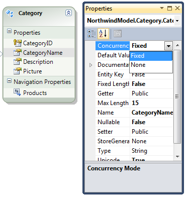

<!-- section start -->

<!-- attr: {id: 'title', class: 'slide-title', hasScriptWrapper: true} -->
# Transactions in ADO.NET and Entity Framework
## How to use transactions in .NET?

<div class="signature">
    <p class="signature-course">Databases</p>
    <p class="signature-initiative">Telerik Software Academy</p>
    <a href="http://academy.telerik.com" class="signature-link">http://academy.telerik.com</a>
</div>

<!-- section start -->

<!-- attr: {id: 'table-of-contents', class:'table-of-contents'} -->
# Table of Contents

*   Transactions in ADO.NET
    *   Starting, committing and aborting transactions
    *   Distributed transactions and `TransactionScope`
    *   Implicit transactions
*   Transactions in Entity Framework
    *   Optimistic Concurrency in EF

<!-- section start -->

<!-- attr: {class: 'slide-section'} -->
#   Using Transactions in ADO.NET
##    `TransactionScope` and more

#   Transactions in ADO.NET

*   Working with transactions in ADO.NET:
    *   Begin a transaction:
        ```cs
        SqlTransaction trans = dbConnection.BeginTransaction();
        ```
    *   Include a command to a transaction:
        ```cs
        sqlCommand.Transaction = trans;
        ```
    *   Commit/abort a transaction
        ```cs
        trans.Commit();
        trans.Rollback();
        ```

<!-- attr: {style: "40px"} -->
#   Transactions in ADO.NET

*   The level of isolation is specified by the enumeration `IsolationLevel`:
    *   `ReadUncommitted`, `ReadCommitted`, `RepeatRead`, `Serializable`, `Snapshot`, `Chaos`

    ```cs
    var trans = dbCon.BeginTransaction(IsolationLevel.ReadCommitted);
    SqlCommand cmd = dbCon.CreateCommand();
    cmd.Transaction = trans;
    try {
      // Perform some SQL commands here …
      trans.Commit();
    }
    catch (SqlException e) {
      Console.WriteLine("Exception: {0}", e.Message);
      trans.Rollback();
      Console.WriteLine("Transaction cancelled.");
    }
    ```

<!-- attr: {class: 'slide-section'} -->
#   ADO.NET Transactions
##  [Demo](http://)

<!-- section start -->

<!-- attr: {class: 'slide-section'} -->
#   Transactions with `TransactionScope`
##    Easier way to create transactions

#   `TransactionScope` Class

*   In ADO.NET you can implement implicit transactions using `TransactionScope`
    *   Each operations in a transaction scope joins the existing ambient transaction
    *   **MSDTC service** may be required to be running
*   Advantages of `TransactionScope`:
    *   Easier to implement
    *   More efficient
    *   Supports distributed transactions (MSDTC)

#   `TransactionScope` Class

*   When instantiating `TransactionScope`:
    *   You either join the existing (ambient) transaction
    *   Or create a new ambient transaction
    *   Or you don't apply transactional logic at all
*   The transaction coordinator (MSDTC) determines to which transaction to participate based on
    *   If there is an open existing transaction
    *   The value of the `TransactionScopeOption` parameter

<!-- attr: {style: "font-size:40px"} -->
#   `TransactionScope` Class

*   `TransactionScopeOption` specifies which transaction to be used (new / existing / none)   

| Value | Exists? | Action                                |
| -----------------------  | ------------------- | ------------------------------------- |
| `Require` (default)      | No                  | New transaction is created            |
| `Require` (default)      | Yes                 | Existing ambient transaction is used  |
| `RequiresNew`            | Yes/No              | New transaction is explicitly created |
| `Suppress`               | Yes/No              | No transaction is used at all         |

#   `TransactionScope` Example

*   `TransactionScope` _Example:_

```cs
void RootMethod()
{
  using (TransactionScope tran = new TransactionScope())
  {
     /* Perform transactional work here */
     SomeMethod();
     tran.Complete();
  }
}
void SomeMethod()
{
  using (TransactionScope transaction =
    new TransactionScope(TransactionScopeOption.Required))
  {
     /* Perform transactional work here */
     transactions.Complete();
  }
}
```

*   `RootMethod()` creates a new transaction
*   `SomeMethod()` joins the existing transaction

#   Completing a Transaction

*   The method `Complete()` informs the transactions coordinator that it is acceptable to commit the transaction
    *   If not called, the transaction will be rolled back
    *   Calling it doesn't guarantee that the transaction will be committed
*   At the end of the using block of the root transaction, it is committed
    *   Only if the root transaction and all joined transactions have called `Complete()`

<!-- attr: {class: 'slide-section'} -->
#   Using `TransactionScope`
##  [Demo](http://)

<!-- section start -->

<!-- attr: {class: 'slide-section'} -->
#   Transactions in Entity Framework
##  Even more user-friendly

<!-- attr: {style: 'font-size:40px'} -->
#   Transactions in Entity Framework

*   In Entity Framework `ObjectContext.SaveChanges()` always operations in a transaction
    *   Either all changes are persisted, or none of them
*   EF transactions use pessimistic concurrency control by default
    *   Enable optimistic concurrency control by `ConcurrencyMode=Fixed` for a certain property
        *   `OptimisticConcurrencyException` is thrown when the changes cannot be persisted
        *   Conflicts can be resolved by `ObjectContext. Refresh(StoreWins / ClientWins)`
*   `TransactionScope` can be used in EF as well

#   Transactions in EF: Example

*   _Example:_

```cs
var db = new NorthwindEntities();
// Add a valid new category
var newCategory = new Category() {
  CategoryName = "New Category",
  Description = "New category, just for testing"
};
db.Categories.AddObject(newCategory);
// Add an invalid new category
var newCategoryLongName = new Category() {
  CategoryName = "New Category Loooooooong Name",
};
db.Categories.AddObject(newCategoryLongName);

// The entire transaction will fail due to
// insertion failure for the second category
db.SaveChanges();
```

<!-- attr: {class: 'slide-section'} -->
#   Transactions in Entity Framework
##  [Demo](http://)

<!-- attr: {hasScriptWrapper: true} -->
#   Optimistic Concurrency in EF

<div>
*   Enabling optimistic concurrency for a certain property of an entity in EF:
</div> <!-- .element: style="float: left;width: 50%; text-align: justify" -->
 <!-- .element: style="float: left;border-radius: 15px" -->


<!-- attr: {style: 'font-size:38px'} -->
#   `OptimisticConcurrencyException`

*   Example of using optimistic concurrency:

```cs
var db = new NorthwindEntities();

var newCategory = new Category() {
  CategoryName = "New Category" };
context.Categories.AddObject(newCategory);
context.SaveChanges();

// This context works in different transaction
var anotherDb = new NorthwindEntities();
var lastCategory = anotherDb.categories.First(cat => cat.CategoryID == newCategory.CategoryID);

lastCategory.CategoryName = lastCategory.CategoryName + " 2";
anotherDb.SaveChanges();

// This will cause OptimisticConcurrencyException if
// Categories.CategoryName has ConcurrencyMode=Fixed
newCategory.CategoryName = newCategory.CategoryName + " 3";
db.SaveChanges();
```

<!-- attr: {class: 'slide-section'} -->
#   Optimistic Concurrency in Entity Framework
##  [Demo](http:)

<!-- section start -->

<!-- attr: {id: 'questions', class: 'slide-questions', showInPresentation: true} -->
# Database Transactions Concepts
## Questions
